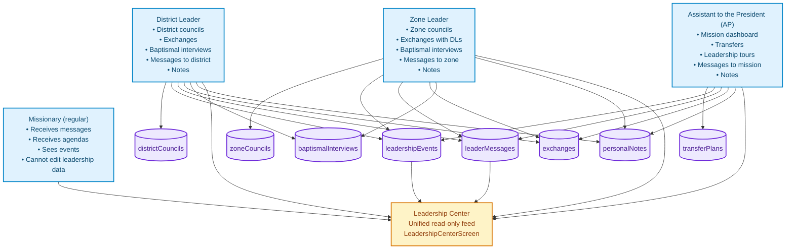

# xthegospel / For The Gospel

**Integrated Web Application to Support Investigators, Missionaries, Members, and Mission Leaders of The Church of Jesus Christ of Latter-day Saints**

---

## 🌟 Vision / Visión

**xthegospel** (For The Gospel / Por el Evangelio) was created with one core purpose:

**Por el Evangelio** was created with one core purpose:

> To help investigators on their path toward baptism, conversion, and a personal relationship with Jesus Christ.

> Ayudar a los investigadores en su camino hacia el bautismo, la conversión y una relación personal con Jesucristo.

The app is designed to **accompany investigators** as they learn about the gospel, giving them:

La aplicación está diseñada para **acompañar a los investigadores** mientras aprenden del Evangelio, dándoles:

- spiritual resources / recursos espirituales
- interactive lessons / lecciones interactivas
- clear commitments / compromisos claros
- and a personal record of their journey with God / y un registro personal de su "historia con Dios"

In addition, the app provides complementary tools for:

Además, la aplicación ofrece herramientas complementarias para:

- **Missionaries** who teach and walk with investigators / **Misioneros** que enseñan y acompañan a los investigadores
- **Members** who support missionary work / **Miembros** que apoyan la obra misional
- **Mission leaders** who coordinate, train, and inspire / **Líderes misionales** que coordinan, capacitan e inspiran

Always with one central question in mind:

Siempre con una pregunta central en mente:

**"How can we help investigators come closer to Christ?"**

**"¿Cómo podemos ayudar a los investigadores a acercarse a Cristo?"**

---

## 📋 Table of Contents / Tabla de Contenidos

1. [Primary Focus: Investigators / Enfoque Principal: Investigadores](#-primary-focus-investigators--enfoque-principal-investigadores)
2. [Additional Modules / Módulos Adicionales](#-additional-modules--módulos-adicionales)
   - [Missionaries / Misioneros](#-missionaries--misioneros)
   - [Members / Miembros](#-members--miembros)
   - [Mission Leaders / Líderes Misionales](#-mission-leaders--líderes-misionales)
3. [Leadership Module Architecture / Arquitectura del Módulo de Liderazgo](#-leadership-module-architecture--arquitectura-del-módulo-de-liderazgo)
4. [Tech Stack / Stack Tecnológico](#-tech-stack--stack-tecnológico)
5. [Quick Start / Inicio Rápido](#-quick-start--inicio-rápido)
6. [Project Structure / Estructura del Proyecto](#-project-structure--estructura-del-proyecto)
7. [Project Status / Estado del Proyecto](#-project-status--estado-del-proyecto)
8. [Next Steps / Próximos Pasos](#-next-steps--próximos-pasos)
9. [Project Philosophy / Filosofía del Proyecto](#-project-philosophy--filosofía-del-proyecto)
10. [License / Licencia](#-license--licencia)

---

## 👤 Primary Focus: Investigators / Enfoque Principal: Investigadores

### Purpose / Propósito

Help investigators:

Ayudar a los investigadores a:

- Understand the doctrines of the gospel / Comprender las doctrinas del Evangelio
- Prepare spiritually for baptism / Prepararse espiritualmente para el bautismo
- Develop a personal testimony / Desarrollar un testimonio personal
- Integrate into the Church community / Integrarse a la comunidad de la Iglesia
- Keep commitments and progress in their conversion / Mantener compromisos y progresar en su conversión

### Key Features / Funciones Clave

#### 📖 Interactive Lessons / Lecciones Interactivas

- Doctrinal content organized in a clear, progressive path / Contenido doctrinal organizado en un camino claro y progresivo
- Study materials adapted to the investigator's level / Materiales de estudio adaptados al nivel del investigador
- Personalized progress tracking / Seguimiento de progreso personalizado

#### 💬 Daily Devotional Messages / Mensajes Devocionales Diarios

- Short, daily spiritual thoughts / Reflexiones espirituales diarias breves
- Scriptures and inspired quotes / Escrituras y citas inspiradas
- Practical application to daily life / Aplicación práctica a la vida diaria

#### 📝 Spiritual Journal – "My Story with God" / Diario Espiritual – "La Historia con Dios"

- Personal record of spiritual experiences / Registro personal de experiencias espirituales
- Space for reflections about their progress / Espacio para reflexiones sobre su progreso
- Notes on key moments of revelation and growth / Notas sobre momentos clave de revelación y crecimiento

#### 🎯 Baptism Preparation / Preparación para el Bautismo

- Step-by-step guide towards baptism / Guía paso a paso hacia el bautismo
- Personal commitments and tasks / Compromisos y tareas personales
- Spiritual readiness tracking / Seguimiento de preparación espiritual

#### ❓ Difficult Questions / Preguntas Difíciles

- FAQ with doctrinally sound answers / FAQ con respuestas doctrinalmente sólidas
- Resources for common doubts / Recursos para dudas comunes
- Support for investigators who are sincerely searching / Apoyo para investigadores que buscan sinceramente

#### 📊 Progress Tracking / Seguimiento de Progreso

- Visual overview of spiritual growth / Visión general del crecimiento espiritual
- Achievements and reached milestones / Logros y metas alcanzadas
- Commitment reminders / Recordatorios de compromisos

---

## 🛠 Additional Modules / Módulos Adicionales

### 👔 Missionaries / Misioneros

Tools for missionaries who teach and support investigators:

Herramientas para misioneros que enseñan y apoyan a los investigadores:

- **Missionary Agenda** / **Agenda Misional**: planning and tracking lessons & visits / planificación y seguimiento de lecciones y visitas
- **People Management** / **Gestión de Personas**: investigators, contacts, members, friends / investigadores, contactos, miembros, amigos
- **Lesson Planning** / **Planificación de Lecciones**: study resources and teaching outlines / recursos de estudio y esquemas de enseñanza
- **Commitment Tracking** / **Seguimiento de Compromisos**: follow-up on investigator commitments / seguimiento de compromisos de investigadores
- **Leadership Center** / **Centro de Liderazgo**: access to agendas, messages, and events from mission leaders / acceso a agendas, mensajes y eventos de los líderes misionales

---

### 👥 Members / Miembros

Resources to help members actively support missionary work:

Recursos para ayudar a los miembros a apoyar activamente la obra misional:

- **Study Modules** / **Módulos de Estudio**: deeper doctrinal content to strengthen testimony / contenido doctrinal profundo para fortalecer el testimonio
- **Interactive Activities** / **Actividades Interactivas**: gamified learning (quizzes, scenarios, exercises) / aprendizaje gamificado (quizzes, escenarios, ejercicios)
- **Convert Care Guide** / **Guía de Cuidado de Conversos**: 7-section guide (available in 4 languages) to support new members / guía de 7 secciones (disponible en 4 idiomas) para apoyar a nuevos miembros
- **Friends Management** / **Gestión de Amigos**: track, pray for, and minister to friends interested in the gospel / rastrear, orar y ministrar a amigos interesados en el Evangelio
- **Missionary Support** / **Apoyo Misionero**: practical ways to help full-time missionaries / formas prácticas de ayudar a los misioneros de tiempo completo
- **Progress Tracking** / **Seguimiento de Progreso**: XP system, levels, streaks, and badges to encourage consistency / sistema de XP, niveles, rachas e insignias para fomentar la consistencia

---

### 🛡️ Mission Leaders / Líderes Misionales (Leadership Module / Módulo de Liderazgo)

This module assists **District Leaders, Zone Leaders, and Assistants to the President** in training and coordinating missionaries — always with the final goal of serving investigators better.

Este módulo ayuda a **Líderes de Distrito, Líderes de Zona y Asistentes del Presidente** a capacitar y coordinar misioneros — siempre con el objetivo final de servir mejor a los investigadores.

**Main functionalities / Funcionalidades principales:**

- **District/Zone Councils** / **Reuniones de Distrito/Zona**  
  Plan and record training meetings with spiritual focus, people-based metrics, and clear follow-up. / Planificar y registrar reuniones de capacitación con enfoque espiritual, métricas basadas en personas y seguimiento claro.

- **Exchanges** / **Intercambios**  
  Organize and document exchanges to train missionaries, share best practices, and discern needs. / Organizar y documentar intercambios para capacitar misioneros, compartir mejores prácticas y discernir necesidades.

- **Baptismal Interviews** / **Entrevistas Bautismales**  
  Coordinate interviews for investigators, with pastoral notes and follow-up. / Coordinar entrevistas para investigadores, con notas pastorales y seguimiento.

- **Leadership Messages** / **Mensajes de Liderazgo**  
  Send spiritual emphasis, focus for the week, and instructions to zones/districts/mission. / Enviar énfasis espiritual, enfoque de la semana e instrucciones a zonas/distritos/misión.

- **Dashboards** / **Dashboards**  
  High-level overview of progress for district, zone, and (for AP) the entire mission. / Visión general de alto nivel del progreso para distrito, zona y (para AP) toda la misión.

---

## 🧩 Leadership Module Architecture / Arquitectura del Módulo de Liderazgo

The Leadership module uses a clean, role-based data architecture based on collections and scopes (mission, zone, district).

El módulo de Liderazgo utiliza una arquitectura de datos limpia basada en roles, colecciones y alcances (misión, zona, distrito).



> **Note / Nota:**  
> This module is an _additional_ feature to improve coordination between leaders and missionaries, so that they can serve investigators with more order, love, and vision.

> Este módulo es una funcionalidad _adicional_ para mejorar la coordinación entre líderes y misioneros, para que puedan servir a los investigadores con más orden, amor y visión.

---

## 🛠 Tech Stack / Stack Tecnológico

- **Frontend:** React 18.3.1, TypeScript
- **Routing:** React Router DOM 6.20.0
- **State Management:** Zustand 5.0.8, React Context API
- **Build Tool:** Vite 5.0.0
- **Styling:** Custom design system with CSS / Sistema de diseño personalizado con CSS
- **Internationalization (i18n):** Custom engine with ES, EN, FR, PT / Motor personalizado con ES, EN, FR, PT
- **Storage:** `localStorage` (prepared for migration to Firestore / real-time sync) / `localStorage` (preparado para migración a Firestore / sincronización en tiempo real)

---

## 🚀 Quick Start / Inicio Rápido

### Prerequisites / Prerrequisitos

- Node.js 18+
- npm

### Installation / Instalación

```bash
# Install dependencies / Instalar dependencias
npm install

# Start dev server / Iniciar servidor de desarrollo
npm run dev

# Build for production / Construir para producción
npm run build

# Preview production build / Vista previa de la build de producción
npm run preview
```

By default, the app runs at: `http://localhost:3000`

Por defecto, la aplicación se ejecuta en: `http://localhost:3000`

---

## 📂 Project Structure / Estructura del Proyecto

```
src/
├── components/                    # Reusable UI components / Componentes UI reutilizables
├── context/                       # React contexts (Auth, I18n, Progress) / Contextos de React
├── data/                          # Static data and lessons / Datos estáticos y lecciones
│   ├── missionary/                # Missionary & leadership configuration / Configuración misional y de liderazgo
│   └── member/                    # Member study modules and activities / Módulos de estudio y actividades de miembros
├── hooks/                         # Custom React hooks / Hooks personalizados de React
├── i18n/                          # Translation files (ES, EN, FR, PT) / Archivos de traducción
├── layouts/                       # Layout components / Componentes de layout
│   └── MissionaryLeadershipLayout.tsx
├── pages/                         # Page-level components / Componentes de página
│   ├── investigator/              # Investigator pages (PRIMARY FOCUS) / Páginas de investigador (ENFOQUE PRINCIPAL)
│   ├── missionary/                # Missionary pages / Páginas de misionero
│   │   └── leadership/            # Leadership screens (additional module) / Pantallas de liderazgo (módulo adicional)
│   └── member/                    # Member pages / Páginas de miembro
├── services/                      # Business logic services / Servicios de lógica de negocio
│   ├── districtCouncilService.ts
│   ├── zoneCouncilService.ts
│   ├── exchangeService.ts
│   ├── baptismalInterviewService.ts
│   ├── leaderMessageService.ts
│   ├── transferPlanService.ts
│   └── personalNoteService.ts
├── router/                        # Routing configuration / Configuración de routing
└── utils/                         # Utility functions / Funciones de utilidad
```

---

## 📊 Project Status / Estado del Proyecto

### ✅ Main Module: Investigators / Módulo Principal: Investigadores

- Interactive lessons & study materials / Lecciones interactivas y materiales de estudio
- Daily devotional messages / Mensajes devocionales diarios
- Spiritual journal **"My Story with God"** / Diario espiritual **"La Historia con Dios"**
- Step-by-step baptism preparation guide / Guía paso a paso de preparación para el bautismo
- Commitments & tasks system / Sistema de compromisos y tareas
- Difficult questions FAQ / FAQ de preguntas difíciles
- Personalized progress tracking / Seguimiento de progreso personalizado

### ✅ Missionary Module / Módulo de Misioneros

- Missionary agenda & scheduling / Agenda misional y programación
- People management (investigators, contacts, members) / Gestión de personas (investigadores, contactos, miembros)
- Lesson plans & teaching resources / Planes de lección y recursos de enseñanza
- Commitment tracking / Seguimiento de compromisos
- Leadership Center (access to leader messages, events, agendas) / Centro de Liderazgo (acceso a mensajes, eventos y agendas de líderes)

### ✅ Member Module / Módulo de Miembros

- Visual dashboard / Dashboard visual
- Deep doctrinal study modules / Módulos de estudio doctrinal profundo
- Interactive, gamified activities / Actividades interactivas y gamificadas
- New convert care guide (7 sections, 4 languages) / Guía de cuidado de nuevos conversos (7 secciones, 4 idiomas)
- Progress tracking (XP, levels, streaks, badges) / Seguimiento de progreso (XP, niveles, rachas, insignias)
- Friends management / Gestión de amigos
- Missionary support resources / Recursos de apoyo misionero
- Full i18n support (ES, EN, FR, PT) / Soporte completo i18n (ES, EN, FR, PT)

### ✅ Additional Module: Mission Leaders / Módulo Adicional: Líderes Misionales

- Full role structure (DL, ZL, AP) / Estructura completa de roles (LD, LZ, AP)
- Services using `localStorage` (ready to migrate to Firestore) / Servicios usando `localStorage` (listo para migrar a Firestore)
- Working hooks for all roles / Hooks funcionales para todos los roles
- Fully functional leadership screens / Pantallas de liderazgo totalmente funcionales
- Leadership Center for missionaries / Centro de Liderazgo para misioneros
- Real-time publication & distribution (within current storage limits) / Publicación y distribución en tiempo real (dentro de los límites de almacenamiento actual)
- Share system (WhatsApp, email, clipboard) / Sistema de compartir (WhatsApp, email, portapapeles)
- Full history of all activities / Historial completo de todas las actividades

---

## ⏳ Next Steps / Próximos Pasos

- 🔄 Migration to **Firestore** for real-time, multi-device sync / Migración a **Firestore** para sincronización en tiempo real y multi-dispositivo
- 📄 PDF export of reports and study materials / Exportación a PDF de reportes y materiales de estudio
- 🔔 Push notifications for key reminders / Notificaciones push para recordatorios importantes
- 📊 Analytics & progress metrics for investigators / Analytics y métricas de progreso para investigadores
- 🌐 Offline synchronization / Sincronización offline
- 🎨 UI/UX improvements and subtle animations / Mejoras de UI/UX y animaciones sutiles
- 🔐 Advanced privacy and granular permissions / Privacidad avanzada y permisos granulares
- 📱 Native mobile version (React Native / Expo) / Versión móvil nativa (React Native / Expo)

---

## 💡 Project Philosophy / Filosofía del Proyecto

This project was built with one spiritual priority:

Este proyecto fue construido con una prioridad espiritual:

> **Help investigators come unto Christ.**

> **Ayudar a los investigadores a venir a Cristo.**

Every module and feature is aligned to that:

Cada módulo y funcionalidad está alineado con eso:

- For **Investigators** / Para **Investigadores**: direct tools for spiritual growth / herramientas directas para el crecimiento espiritual
- For **Missionaries** / Para **Misioneros**: resources to teach and walk with investigators / recursos para enseñar y caminar con los investigadores
- For **Members** / Para **Miembros**: guides to strengthen converts and friends of the Church / guías para fortalecer conversos y amigos de la Iglesia
- For **Leaders** / Para **Líderes**: coordination tools to train missionaries who then serve investigators better / herramientas de coordinación para capacitar misioneros que luego sirven mejor a los investigadores

The central question behind each new feature is:

La pregunta central detrás de cada nueva funcionalidad es:

> _"How does this help investigators draw nearer to the Savior?"_

> _"¿Cómo ayuda esto a los investigadores a acercarse más al Salvador?"_

---

## 📄 License / Licencia

This project is intended for internal use to support the work of
**The Church of Jesus Christ of Latter-day Saints.**

Este proyecto está destinado para uso interno para apoyar la obra de
**La Iglesia de Jesucristo de los Santos de los Últimos Días.**

Designed & Architected by: **Víctor Ruiz Bello**

Diseñado y Arquitectado por: **Víctor Ruiz Bello**

> "And whatsoever ye do, do it heartily, as to the Lord, and not unto men." — Colossians 3:23

---

---

# README en Español

> **Nota:** La interfaz principal del proyecto y la documentación técnica se mantienen en inglés.  
> A continuación se incluye un resumen completo en español.

---

## 📘 Por el Evangelio

**Aplicación Web Integral para Apoyar a Investigadores, Misioneros, Miembros y Líderes de La Iglesia de Jesucristo de los Santos de los Últimos Días**

### 🌟 Visión General

**Por el Evangelio** nació con un propósito principal:

> Ayudar a los investigadores en su camino hacia el bautismo, la conversión y una relación personal con Jesucristo.

La aplicación acompaña a los investigadores mientras aprenden del Evangelio, dándoles:

* recursos espirituales
* lecciones interactivas
* compromisos claros
* y un registro personal de su "historia con Dios".

Además, ofrece herramientas para:

* **Misioneros** que enseñan y acompañan
* **Miembros** que apoyan la obra misional
* **Líderes misionales** que coordinan y capacitan

---

### 👤 Enfoque Principal: Investigadores

* Comprender las doctrinas del Evangelio
* Prepararse espiritualmente para el bautismo
* Desarrollar un testimonio personal
* Integrarse a la comunidad de la Iglesia
* Mantener compromisos y progresar en su conversión

**Funciones clave:**

* **Lecciones interactivas**
* **Mensajes devocionales diarios**
* **Diario espiritual "La historia con Dios"**
* **Guía de preparación para el bautismo**
* **Preguntas difíciles (FAQ)**
* **Seguimiento de progreso**

---

### 👔 Módulo: Misioneros

* Agenda misional
* Gestión de personas (investigadores, contactos, miembros)
* Planificación de lecciones
* Seguimiento de compromisos
* Acceso al **Centro de Liderazgo**

---

### 👥 Módulo: Miembros

* Módulos de estudio doctrinal profundo
* Actividades interactivas y gamificación
* Guía de cuidado de nuevos conversos (7 secciones, 4 idiomas)
* Gestión de amigos interesados en el Evangelio
* Recursos para apoyar a los misioneros
* Sistema de XP, niveles, rachas e insignias

---

### 🛡️ Módulo Adicional: Líderes Misionales

Herramientas para **Líderes de Distrito, Líderes de Zona y Asistentes del Presidente**:

* Reuniones de distrito/zona (planificación y registro)
* Intercambios (planificación, seguimiento, notas espirituales)
* Entrevistas bautismales (coordinación y notas pastorales)
* Mensajes de liderazgo (enfoque doctrinal, metas, anuncios)
* Dashboards de progreso (distrito, zona, misión)
* Centro de liderazgo de solo lectura para los misioneros

La arquitectura está basada en colecciones como:

* `districtCouncils`, `zoneCouncils`
* `leadershipEvents`, `leaderMessages`
* `exchanges`, `baptismalInterviews`
* `transferPlans`, `personalNotes`

Y un **LeadershipCenterScreen** que reúne todo para el misionero regular.

---

### 🛠 Stack Tecnológico (resumen)

* React 18 + TypeScript
* React Router DOM
* Zustand + Context API
* Vite
* CSS con diseño personalizado
* i18n (ES, EN, FR, PT)
* `localStorage` (listo para migrar a Firestore)

---

### 📊 Estado del Proyecto

Totalmente implementado para:

* Investigadores (módulo principal)
* Misioneros
* Miembros
* Líderes misionales (módulo adicional, listo para migrar a Firestore y a app móvil nativa)

---

### 💡 Filosofía

El enfoque siempre será:

> **¿Cómo ayudamos mejor a los investigadores a acercarse a Cristo?**

Todo lo demás —misioneros, miembros, líderes— existe para servir ese propósito.

---

### 📄 Licencia

Uso interno para apoyar la obra misional de **La Iglesia de Jesucristo de los Santos de los Últimos Días**.

Diseñado y Arquitectado por: **Víctor Ruiz Bello**
