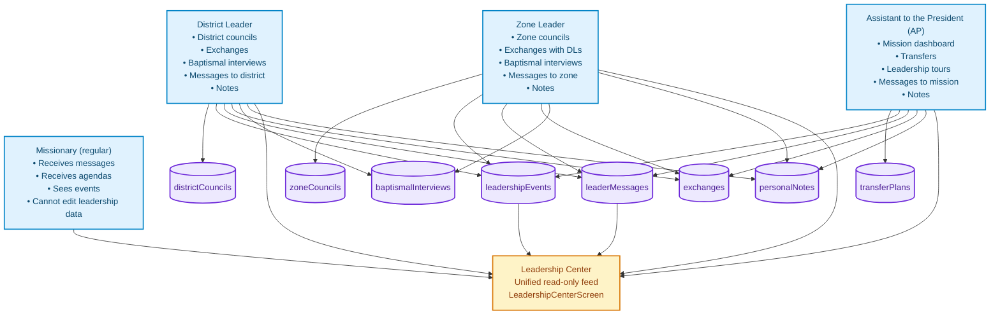

# xthegospel / For The Gospel

**Integrated Web Application to Support Investigators, Missionaries, Members, and Mission Leaders of The Church of Jesus Christ of Latter-day Saints**

---

## 🌟 Vision

**Por el Evangelio** was created with one core purpose:

> To help investigators on their path toward baptism, conversion, and a personal relationship with Jesus Christ.

The app is designed to **accompany investigators** as they learn about the gospel, giving them:
- spiritual resources
- interactive lessons
- clear commitments
- and a personal record of their journey with God.

In addition, the app provides complementary tools for:

- **Missionaries** who teach and walk with investigators  
- **Members** who support missionary work  
- **Mission leaders** who coordinate, train, and inspire  

Always with one central question in mind:  

**"How can we help investigators come closer to Christ?"**

---

## 📋 Table of Contents

1. [Primary Focus: Investigators](#-primary-focus-investigators)  
2. [Additional Modules](#-additional-modules)  
   - [Missionaries](#-missionaries)  
   - [Members](#-members)  
   - [Mission Leaders](#-mission-leaders-leadership-module)  
3. [Leadership Module Architecture](#-leadership-module-architecture)  
4. [Tech Stack](#-tech-stack)  
5. [Quick Start](#-quick-start)  
6. [Project Structure](#-project-structure)  
7. [Project Status](#-project-status)  
8. [Next Steps](#-next-steps)  
9. [Project Philosophy](#-project-philosophy)  
10. [License](#-license)

---

## 👤 Primary Focus: Investigators

### Purpose

Help investigators:

- Understand the doctrines of the gospel  
- Prepare spiritually for baptism  
- Develop a personal testimony  
- Integrate into the Church community  
- Keep commitments and progress in their conversion

### Key Features

#### 📖 Interactive Lessons

- Doctrinal content organized in a clear, progressive path  
- Study materials adapted to the investigator's level  
- Personalized progress tracking

#### 💬 Daily Devotional Messages

- Short, daily spiritual thoughts  
- Scriptures and inspired quotes  
- Practical application to daily life

#### 📝 Spiritual Journal – "My Story with God"

- Personal record of spiritual experiences  
- Space for reflections about their progress  
- Notes on key moments of revelation and growth

#### 🎯 Baptism Preparation

- Step-by-step guide towards baptism  
- Personal commitments and tasks  
- Spiritual readiness tracking

#### ❓ Difficult Questions

- FAQ with doctrinally sound answers  
- Resources for common doubts  
- Support for investigators who are sincerely searching

#### 📊 Progress Tracking

- Visual overview of spiritual growth  
- Achievements and reached milestones  
- Commitment reminders

---

## 🛠 Additional Modules

### 👔 Missionaries

Tools for missionaries who teach and support investigators:

- **Missionary Agenda**: planning and tracking lessons & visits  
- **People Management**: investigators, contacts, members, friends  
- **Lesson Planning**: study resources and teaching outlines  
- **Commitment Tracking**: follow-up on investigator commitments  
- **Leadership Center**: access to agendas, messages, and events from mission leaders  

---

### 👥 Members

Resources to help members actively support missionary work:

- **Study Modules**: deeper doctrinal content to strengthen testimony  
- **Interactive Activities**: gamified learning (quizzes, scenarios, exercises)  
- **Convert Care Guide**: 7-section guide (available in 4 languages) to support new members  
- **Friends Management**: track, pray for, and minister to friends interested in the gospel  
- **Missionary Support**: practical ways to help full-time missionaries  
- **Progress Tracking**: XP system, levels, streaks, and badges to encourage consistency  

---

### 🛡️ Mission Leaders (Leadership Module)

This module assists **District Leaders, Zone Leaders, and Assistants to the President** in training and coordinating missionaries — always with the final goal of serving investigators better.

**Main functionalities:**

- **District/Zone Councils**  
  Plan and record training meetings with spiritual focus, people-based metrics, and clear follow-up.

- **Exchanges**  
  Organize and document exchanges to train missionaries, share best practices, and discern needs.

- **Baptismal Interviews**  
  Coordinate interviews for investigators, with pastoral notes and follow-up.

- **Leadership Messages**  
  Send spiritual emphasis, focus for the week, and instructions to zones/districts/mission.

- **Dashboards**  
  High-level overview of progress for district, zone, and (for AP) the entire mission.

---

## 🧩 Leadership Module Architecture

The Leadership module uses a clean, role-based data architecture based on collections and scopes (mission, zone, district).



> **Note:**  
> This module is an *additional* feature to improve coordination between leaders and missionaries, so that they can serve investigators with more order, love, and vision.

---

## 🛠 Tech Stack

* **Frontend:** React 18.3.1, TypeScript
* **Routing:** React Router DOM 6.20.0
* **State Management:** Zustand 5.0.8, React Context API
* **Build Tool:** Vite 5.0.0
* **Styling:** Custom design system with CSS
* **Internationalization (i18n):** Custom engine with ES, EN, FR, PT
* **Storage:** `localStorage` (prepared for migration to Firestore / real-time sync)

---

## 🚀 Quick Start

### Prerequisites

* Node.js 18+
* npm

### Installation

```bash
# Install dependencies
npm install

# Start dev server
npm run dev

# Build for production
npm run build

# Preview production build
npm run preview
```

By default, the app runs at: `http://localhost:3000`

---

## 📂 Project Structure

```
src/
├── components/                    # Reusable UI components
├── context/                       # React contexts (Auth, I18n, Progress)
├── data/                          # Static data and lessons
│   ├── missionary/                # Missionary & leadership configuration
│   └── member/                    # Member study modules and activities
├── hooks/                         # Custom React hooks
├── i18n/                          # Translation files (ES, EN, FR, PT)
├── layouts/                       # Layout components
│   └── MissionaryLeadershipLayout.tsx
├── pages/                         # Page-level components
│   ├── investigator/              # Investigator pages (PRIMARY FOCUS)
│   ├── missionary/                # Missionary pages
│   │   └── leadership/            # Leadership screens (additional module)
│   └── member/                    # Member pages
├── services/                      # Business logic services
│   ├── districtCouncilService.ts
│   ├── zoneCouncilService.ts
│   ├── exchangeService.ts
│   ├── baptismalInterviewService.ts
│   ├── leaderMessageService.ts
│   ├── transferPlanService.ts
│   └── personalNoteService.ts
├── router/                        # Routing configuration
└── utils/                         # Utility functions
```

---

## 📊 Project Status

### ✅ Main Module: Investigators

* Interactive lessons & study materials
* Daily devotional messages
* Spiritual journal **"My Story with God"**
* Step-by-step baptism preparation guide
* Commitments & tasks system
* Difficult questions FAQ
* Personalized progress tracking

### ✅ Missionary Module

* Missionary agenda & scheduling
* People management (investigators, contacts, members)
* Lesson plans & teaching resources
* Commitment tracking
* Leadership Center (access to leader messages, events, agendas)

### ✅ Member Module

* Visual dashboard
* Deep doctrinal study modules
* Interactive, gamified activities
* New convert care guide (7 sections, 4 languages)
* Progress tracking (XP, levels, streaks, badges)
* Friends management
* Missionary support resources
* Full i18n support (ES, EN, FR, PT)

### ✅ Additional Module: Mission Leaders

* Full role structure (DL, ZL, AP)
* Services using `localStorage` (ready to migrate to Firestore)
* Working hooks for all roles
* Fully functional leadership screens
* Leadership Center for missionaries
* Real-time publication & distribution (within current storage limits)
* Share system (WhatsApp, email, clipboard)
* Full history of all activities

---

## ⏳ Next Steps

* 🔄 Migration to **Firestore** for real-time, multi-device sync
* 📄 PDF export of reports and study materials
* 🔔 Push notifications for key reminders
* 📊 Analytics & progress metrics for investigators
* 🌐 Offline synchronization
* 🎨 UI/UX improvements and subtle animations
* 🔐 Advanced privacy and granular permissions
* 📱 Native mobile version (React Native / Expo)

---

## 💡 Project Philosophy

This project was built with one spiritual priority:

> **Help investigators come unto Christ.**

Every module and feature is aligned to that:

* For **Investigators**: direct tools for spiritual growth
* For **Missionaries**: resources to teach and walk with investigators
* For **Members**: guides to strengthen converts and friends of the Church
* For **Leaders**: coordination tools to train missionaries who then serve investigators better

The central question behind each new feature is:

> *"How does this help investigators draw nearer to the Savior?"*

---

## 📄 License

This project is intended for internal use to support the work of
**The Church of Jesus Christ of Latter-day Saints.**

Designed & Architected by: **Víctor Ruiz Bello**

> "And whatsoever ye do, do it heartily, as to the Lord, and not unto men." — Colossians 3:23

---

---

# README en Español

> **Nota:** La interfaz principal del proyecto y la documentación técnica se mantienen en inglés.  
> A continuación se incluye un resumen completo en español.

---

## 📘 Por el Evangelio

**Aplicación Web Integral para Apoyar a Investigadores, Misioneros, Miembros y Líderes de La Iglesia de Jesucristo de los Santos de los Últimos Días**

### 🌟 Visión General

**Por el Evangelio** nació con un propósito principal:

> Ayudar a los investigadores en su camino hacia el bautismo, la conversión y una relación personal con Jesucristo.

La aplicación acompaña a los investigadores mientras aprenden del Evangelio, dándoles:

* recursos espirituales
* lecciones interactivas
* compromisos claros
* y un registro personal de su "historia con Dios".

Además, ofrece herramientas para:

* **Misioneros** que enseñan y acompañan
* **Miembros** que apoyan la obra misional
* **Líderes misionales** que coordinan y capacitan

---

### 👤 Enfoque Principal: Investigadores

* Comprender las doctrinas del Evangelio
* Prepararse espiritualmente para el bautismo
* Desarrollar un testimonio personal
* Integrarse a la comunidad de la Iglesia
* Mantener compromisos y progresar en su conversión

**Funciones clave:**

* **Lecciones interactivas**
* **Mensajes devocionales diarios**
* **Diario espiritual "La historia con Dios"**
* **Guía de preparación para el bautismo**
* **Preguntas difíciles (FAQ)**
* **Seguimiento de progreso**

---

### 👔 Módulo: Misioneros

* Agenda misional
* Gestión de personas (investigadores, contactos, miembros)
* Planificación de lecciones
* Seguimiento de compromisos
* Acceso al **Centro de Liderazgo**

---

### 👥 Módulo: Miembros

* Módulos de estudio doctrinal profundo
* Actividades interactivas y gamificación
* Guía de cuidado de nuevos conversos (7 secciones, 4 idiomas)
* Gestión de amigos interesados en el Evangelio
* Recursos para apoyar a los misioneros
* Sistema de XP, niveles, rachas e insignias

---

### 🛡️ Módulo Adicional: Líderes Misionales

Herramientas para **Líderes de Distrito, Líderes de Zona y Asistentes del Presidente**:

* Reuniones de distrito/zona (planificación y registro)
* Intercambios (planificación, seguimiento, notas espirituales)
* Entrevistas bautismales (coordinación y notas pastorales)
* Mensajes de liderazgo (enfoque doctrinal, metas, anuncios)
* Dashboards de progreso (distrito, zona, misión)
* Centro de liderazgo de solo lectura para los misioneros

La arquitectura está basada en colecciones como:

* `districtCouncils`, `zoneCouncils`
* `leadershipEvents`, `leaderMessages`
* `exchanges`, `baptismalInterviews`
* `transferPlans`, `personalNotes`

Y un **LeadershipCenterScreen** que reúne todo para el misionero regular.

---

### 🛠 Stack Tecnológico (resumen)

* React 18 + TypeScript
* React Router DOM
* Zustand + Context API
* Vite
* CSS con diseño personalizado
* i18n (ES, EN, FR, PT)
* `localStorage` (listo para migrar a Firestore)

---

### 📊 Estado del Proyecto

Totalmente implementado para:

* Investigadores (módulo principal)
* Misioneros
* Miembros
* Líderes misionales (módulo adicional, listo para migrar a Firestore y a app móvil nativa)

---

### 💡 Filosofía

El enfoque siempre será:

> **¿Cómo ayudamos mejor a los investigadores a acercarse a Cristo?**

Todo lo demás —misioneros, miembros, líderes— existe para servir ese propósito.

---

### 📄 Licencia

Uso interno para apoyar la obra misional de **La Iglesia de Jesucristo de los Santos de los Últimos Días**.

Diseñado y Arquitectado por: **Víctor Ruiz Bello**
