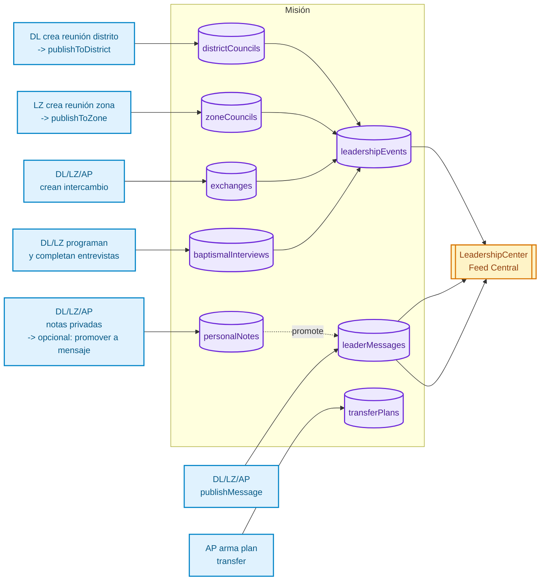

# 📘 Mi Diario Misional

**Aplicación Web Integral para Misioneros, Investigadores, Miembros y Líderes de La Iglesia de Jesucristo de los Santos de los Últimos Días**

---

## 📋 Tabla de Contenidos

- [Visión General](#-visión-general)
- [Módulo de Liderazgo Misional](#-módulo-de-liderazgo-misional)
- [Roles de Usuario](#-roles-de-usuario)
- [Stack Tecnológico](#-stack-tecnológico)
- [Inicio Rápido](#-inicio-rápido)

---

## 🌟 Visión General

Esta aplicación web proporciona cuatro roles de usuario distintos, cada uno con características y contenido personalizado:

1. **Investigador** - Para quienes están aprendiendo sobre la Iglesia
2. **Misionero** - Para misioneros de tiempo completo
3. **Miembro** - Para miembros que apoyan la obra misional
4. **Líder Misional** - Para líderes de distrito, zona y asistentes del presidente

---

# 🛡️ Módulo de Liderazgo Misional

**Sistema de Coordinación y Capacitación para Misiones de La Iglesia de Jesucristo de los Santos de los Últimos Días**

---

## 🌟 Visión General

Este módulo transforma la organización misional en un sistema moderno, ordenado y escalable. Cada líder —Distrito, Zona o Asistente del Presidente— cuenta con herramientas reales para dirigir, entrenar, comunicar y coordinar; todo desde la palma de su mano.

El misionero regular recibe solo lo necesario: agendas, mensajes y eventos relevantes.

**Lo que antes requería papeles, WhatsApp, llamadas y cadenas informales… ahora fluye con orden celestial.**

---

## 🏛 Arquitectura del Sistema

### Diagrama General del Sistema

```mermaid
flowchart TD
    %% Roles
    A1[<b>Misionero Regular</b><br/>• Recibe mensajes<br/>• Recibe agendas<br/>• Ve eventos<br/>• No edita]:::role
    A2[<b>Líder de Distrito</b><br/>• Reunión de distrito<br/>• Intercambios<br/>• Entrevistas<br/>• Mensajes a distrito<br/>• Notas]:::role
    A3[<b>Líder de Zona</b><br/>• Reunión de zona<br/>• Intercambios<br/>• Entrevistas LZ<br/>• Mensajes a zona<br/>• Notas]:::role
    A4[<b>Asistente del Presidente (AP)</b><br/>• Giras<br/>• Transfers<br/>• Mensajes misión<br/>• Dashboard misión<br/>• Notas AP]:::role
    A5[<b>Presidente de Misión</b><br/>• Lectura global<br/>• Recibe reportes<br/>• Supervisa]:::role

    %% Principal collections
    B1[(leadershipEvents)]:::db
    B2[(leaderMessages)]:::db
    B3[(districtCouncils)]:::db
    B4[(zoneCouncils)]:::db
    B5[(exchanges)]:::db
    B6[(baptismalInterviews)]:::db
    B7[(transferPlans)]:::db
    B8[(personalNotes)]:::db

    %% Centro de liderazgo
    C1[[<b>Centro de Liderazgo</b><br/>Feed único para todos<br/>LeadershipCenterScreen]]:::center

    %% Connections
    A2 --> B3
    A3 --> B4
    A4 --> B7

    A2 --> B1
    A3 --> B1
    A4 --> B1

    A2 --> B2
    A3 --> B2
    A4 --> B2

    A2 --> B5
    A3 --> B5
    A4 --> B5

    A2 --> B6
    A3 --> B6

    A2 --> B8
    A3 --> B8
    A4 --> B8

    %% Feed
    B1 --> C1
    B2 --> C1

    A1 --> C1
    A2 --> C1
    A3 --> C1
    A4 --> C1
    A5 --> C1

    classDef role fill:#e0f2fe,stroke:#0284c7,stroke-width:2px,color:#0c4a6e
    classDef db fill:#ede9fe,stroke:#6d28d9,stroke-width:2px,color:#4c1d95
    classDef center fill:#fef3c7,stroke:#d97706,stroke-width:2px,color:#92400e
```

### Arquitectura de Datos (Firestore)



---

## 🛠 Funcionalidad Principal

### 👤 Misionero Regular

**Acceso al Centro de Liderazgo:**
- Reuniones programadas (LD, LZ, AP)
- Mensajes oficiales
- Recordatorios
- Anuncios
- Eventos próximos
- Vista de solo lectura de agendas y detalles

### 🟦 Líder de Distrito (DL)

**Herramientas de Liderazgo:**
- **Reunión de distrito**: Crear, publicar y completar agendas semanales
- **Intercambios**: Planificar, ejecutar y dar seguimiento a intercambios con misioneros
- **Entrevistas bautismales**: Organizar, programar y completar entrevistas
- **Mensajes al distrito**: Publicar mensajes espirituales y anuncios
- **Notas personales**: Bitácora privada con opción de promover a mensajes
- **Dashboard**: KPIs del distrito, eventos próximos y mensajes recientes

### 🟨 Líder de Zona (LZ)

**Herramientas de Supervisión:**
- **Reunión de zona**: Crear, publicar y completar consejos de zona
- **Intercambios**: Giras con líderes de distrito y misioneros clave
- **Entrevistas bautismales**: Supervisar y realizar entrevistas a nivel zona
- **Mensajes a la zona**: Publicar mensajes y énfasis para toda la zona
- **Notas de liderazgo**: Reflexiones y seguimiento de distritos
- **Dashboard de zona**: Visión general de todos los distritos bajo su supervisión

### 🟣 Asistente del Presidente (AP)

**Herramientas de Misión:**
- **Dashboard de la misión**: Visión global en tiempo real de toda la misión
- **Giras / intercambios**: Planificar y ejecutar giras con líderes de zona
- **Planificación de transfers**: Crear y gestionar planes de transferencias
- **Mensajes oficiales**: Publicar mensajes a toda la misión o zonas específicas
- **Notas privadas**: Reflexiones de alto nivel y seguimiento misional
- **Apoyo al Presidente**: Checklist y herramientas para servir al presidente

---

## 🏗 Estructura Técnica

### Colecciones de Datos (localStorage/Firestore)

| Colección | Propósito | Roles que Crean | Roles que Ven |
|-----------|-----------|----------------|---------------|
| `districtCouncils` | Reuniones de distrito | DL | DL, LZ, AP, Misioneros (solo lectura) |
| `zoneCouncils` | Reuniones de zona | LZ | LZ, AP, Misioneros (solo lectura) |
| `leadershipEvents` | Feed central de eventos | DL, LZ, AP | Todos |
| `leaderMessages` | Mensajes oficiales | DL, LZ, AP | Todos (según scope) |
| `exchanges` | Intercambios y giras | DL, LZ, AP | Creador, misionero involucrado |
| `baptismalInterviews` | Entrevistas bautismales | DL, LZ | DL, LZ, AP, Compañerismo |
| `transferPlans` | Planes de transferencias | AP | AP |
| `personalNotes` | Notas privadas | DL, LZ, AP | Solo el creador |

### Flujo de Publicación

1. **Líder crea contenido** (reunión, mensaje, intercambio, etc.)
2. **Guarda como borrador** → Se almacena en su colección correspondiente
3. **Publica** → Se crea un `leadershipEvent` en el feed central
4. **Distribución automática** → Aparece en el Centro de Liderazgo según:
   - `targetScope` (district, zone, mission)
   - `districtId` / `zoneId` del misionero
   - Filtros de rol y permisos

### Servicios Principales

- `districtCouncilService.ts` - Gestión de reuniones de distrito
- `zoneCouncilService.ts` - Gestión de reuniones de zona
- `exchangeService.ts` - Gestión de intercambios (reutilizable por todos los roles)
- `baptismalInterviewService.ts` - Gestión de entrevistas bautismales
- `leaderMessageService.ts` - Gestión de mensajes de liderazgo
- `transferPlanService.ts` - Gestión de planes de transferencias
- `personalNoteService.ts` - Gestión de notas personales
- `shareService.ts` - Compartir contenido (WhatsApp, Email, Clipboard)

---

## 🔒 Seguridad y Roles

Cada acción está protegida por:

- **Rol del usuario**: `missionary`, `district_leader`, `zone_leader`, `assistant_to_president`
- **Filtros geográficos**: `zoneId`, `districtId`, `missionId`
- **Scope del contenido**: `district`, `zone`, `mission`
- **Permisos de lectura/escritura**: Los misioneros regulares solo leen contenido publicado

**Los misioneros regulares nunca ven información interna de liderazgo.**

---

## 📱 Filosofía del Sistema

- **Sencillo para el usuario**: Interfaz intuitiva, sin complejidad innecesaria
- **Poderoso para el líder**: Herramientas completas para dirigir eficazmente
- **Ordenado para la misión**: Todo centralizado y accesible
- **Eficiente para el presidente**: Visión global y reportes claros

Un diseño inspirado en los principios de:
- **Transparencia**: Todos ven lo que necesitan ver
- **Diligencia**: Herramientas para ser más efectivos
- **Responsabilidad**: Registro claro de acciones y decisiones
- **Liderazgo cristiano**: Enfoque en personas, no solo números

---

## 🧩 Estado Actual

### ✅ Implementado

- ✅ Estructura completa de roles (DL, LZ, AP)
- ✅ Servicios con localStorage (listos para migrar a Firestore)
- ✅ Hooks funcionales para todos los roles
- ✅ Pantallas totalmente operativas:
  - Dashboards por rol
  - Reuniones de distrito/zona
  - Intercambios y giras
  - Entrevistas bautismales
  - Mensajes de liderazgo
  - Planes de transferencias
  - Notas personales
  - Perfil y cambio de roles
- ✅ Centro de liderazgo para misioneros
- ✅ Publicación y distribución en tiempo real
- ✅ Sistema de compartir (WhatsApp, Email, Clipboard)
- ✅ Historial completo de todas las actividades
- ✅ Validaciones y estados (draft, published, completed)

### ⏳ Próximas Mejoras

- 🔄 Migración a Firestore para sincronización en tiempo real
- 📄 Exportación a PDF de agendas y reportes
- 🔔 Notificaciones push para eventos importantes
- 📊 Analytics y métricas avanzadas
- 🌐 Sincronización offline
- 🎨 Mejoras de UI/UX y animaciones
- 🔐 Privacidad avanzada y permisos granulares

---

## 🚀 Inicio Rápido

### Requisitos

- Node.js 18+
- React 18+
- React Router DOM 6+

### Instalación

```bash
npm install
npm run dev
```

### Estructura de Carpetas

```
src/
├── pages/missionary/leadership/    # Pantallas de liderazgo
├── services/                        # Servicios de datos
├── components/missionary/leadership/ # Componentes reutilizables
├── hooks/                          # Hooks personalizados
├── data/missionary/                # Configuración de roles
└── layouts/                        # Layouts de navegación
```

---

## 📊 Métricas y KPIs

El sistema rastrea automáticamente:

- **Reuniones realizadas** por distrito/zona
- **Intercambios completados** por líder
- **Entrevistas bautismales** programadas y completadas
- **Mensajes publicados** por scope
- **Participación** en el Centro de Liderazgo

---

## 🙌 Agradecimientos

Este proyecto nace del deseo sincero de servir a la obra del Señor, elevando el estándar de coordinación y liderazgo dentro de las misiones.

**Organización, inspiración y orden — tal como Él lo manda.**

---

---

## 👤 Otros Módulos de la Aplicación

### 👤 Investigador

**Características:**
- Mensajes devocionales diarios
- Lecciones interactivas y materiales de estudio
- Seguimiento de progreso
- Guía de preparación para el bautismo
- Compromisos y tareas personales
- Diario de la historia con Dios
- Preguntas difíciles FAQ

### 👔 Misionero Regular

**Características:**
- Agenda misional y programación
- Gestión de personas (investigadores, contactos)
- Planificación de lecciones y recursos
- Seguimiento de compromisos
- Monitoreo de progreso
- **Centro de Liderazgo**: Acceso a agendas, mensajes y eventos de sus líderes

### 👥 Miembro

**Características:**
- **Módulos de Estudio**: Contenido doctrinal profundo organizado por temas
  - Doctrina de Cristo en la vida diaria
  - Trabajar con los misioneros
  - Compartir el evangelio naturalmente
  - Cuidado de nuevos conversos
  - Preparación para el templo
- **Actividades Interactivas**: Experiencias de aprendizaje gamificadas
  - Quizzes doctrinales
  - Escenarios del mundo real
  - Ejercicios de emparejamiento de escrituras
  - Juegos de adivinanza de personajes
  - Asignaciones misionales del mundo real
  - Bloques de lectura con reflexión
- **Cuidado de Conversos**: Guía completa para apoyar a nuevos miembros
  - Bienvenida al Reino
  - Integración al barrio
  - Preparación para el Sacerdocio Aarónico y de Melquisedec
  - Guía para la primera visita al templo
  - Preparación para la recomendación del templo
  - Ruta de crecimiento espiritual de 90 días
- **Gestión de Amigos**: Rastrear y orar por amigos interesados en el evangelio
- **Apoyo Misionero**: Formas de ayudar a los misioneros de tiempo completo
- **Seguimiento de Progreso**: Sistema de XP, niveles, rachas e insignias

---

## 🛠 Stack Tecnológico

- **Frontend**: React 18.3.1, TypeScript
- **Routing**: React Router DOM 6.20.0
- **State Management**: Zustand 5.0.8, React Context API
- **Build Tool**: Vite 5.0.0
- **Styling**: CSS con sistema de diseño personalizado
- **Internationalization**: Sistema i18n personalizado (ES, EN, FR, PT)
- **Storage**: localStorage (preparado para migración a Firestore)

---

## 🚀 Inicio Rápido

### Prerrequisitos

- Node.js 18+ y npm

### Instalación

```bash
# Instalar dependencias
npm install

# Iniciar servidor de desarrollo
npm run dev

# Construir para producción
npm run build

# Vista previa de la build de producción
npm run preview
```

La aplicación estará disponible en `http://localhost:3000`

### Estructura del Proyecto

```
src/
├── components/                    # Componentes UI reutilizables
├── context/                      # Contextos de React (Auth, I18n, Progress)
├── data/                         # Datos estáticos y lecciones
│   ├── missionary/               # Configuración de roles de liderazgo
│   └── member/                   # Módulos de estudio y actividades
├── hooks/                        # Hooks personalizados de React
├── i18n/                         # Archivos de traducción (ES, EN, FR, PT)
├── layouts/                      # Layouts de navegación
│   └── MissionaryLeadershipLayout.tsx
├── pages/                        # Componentes de página
│   ├── investigator/            # Páginas de investigador
│   ├── missionary/              # Páginas de misionero
│   │   └── leadership/          # Pantallas de liderazgo
│   └── member/                  # Páginas de miembro
├── services/                    # Servicios de lógica de negocio
│   ├── districtCouncilService.ts
│   ├── zoneCouncilService.ts
│   ├── exchangeService.ts
│   ├── baptismalInterviewService.ts
│   ├── leaderMessageService.ts
│   ├── transferPlanService.ts
│   └── personalNoteService.ts
├── router/                      # Configuración de routing
└── utils/                       # Funciones de utilidad
```

---

## 📊 Estado del Proyecto

### ✅ Implementado

#### Módulo de Liderazgo
- ✅ Estructura completa de roles (DL, LZ, AP)
- ✅ Servicios con localStorage (listos para migrar a Firestore)
- ✅ Hooks funcionales para todos los roles
- ✅ Pantallas totalmente operativas
- ✅ Centro de liderazgo para misioneros
- ✅ Publicación y distribución en tiempo real
- ✅ Sistema de compartir (WhatsApp, Email, Clipboard)
- ✅ Historial completo de todas las actividades

#### Otros Módulos
- ✅ Dashboard visual para rol miembro
- ✅ Módulos de estudio con contenido doctrinal profundo
- ✅ Actividades interactivas con gamificación
- ✅ Guía de cuidado de nuevos conversos (7 secciones, 4 idiomas)
- ✅ Seguimiento de progreso (XP, niveles, rachas, insignias)
- ✅ Gestión de amigos
- ✅ Recursos de apoyo misionero
- ✅ Soporte completo i18n (ES, EN, FR, PT)

### ⏳ Próximas Mejoras

- 🔄 Migración a Firestore para sincronización en tiempo real
- 📄 Exportación a PDF de agendas y reportes
- 🔔 Notificaciones push para eventos importantes
- 📊 Analytics y métricas avanzadas
- 🌐 Sincronización offline
- 🎨 Mejoras de UI/UX y animaciones
- 🔐 Privacidad avanzada y permisos granulares

---

## 📄 Licencia

Este proyecto es de uso interno para misiones de La Iglesia de Jesucristo de los Santos de los Últimos Días.

---

**Designed & Architected by:** Víctor Ruiz Bello

*"Y todo lo que hagáis, hacedlo de corazón, como para el Señor y no para los hombres"* — Colosenses 3:23
