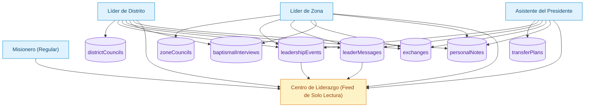

# xTheGospel

### For The Gospel — A Multilingual Web Application for Investigators, Missionaries, Members, and Mission Leaders

### _(Natively available in English, Spanish, French, and Portuguese)_

---

## 🌟 Vision & Purpose

**xTheGospel (For The Gospel)** is a fully integrated gospel-focused platform designed to:

> **Help investigators come unto Christ and progress toward baptism, conversion, and a lasting relationship with the Savior.**

This application provides a unified, spiritually centered experience for four main audiences:

1. **Investigators** — The primary focus of the entire platform

2. **Missionaries** — Teachers and gospel companions who guide investigators

3. **Members** — Supporters who strengthen and accompany new friends

4. **Mission Leaders (DL, ZL, AP)** — Coordinators and spiritual trainers of the work

The entire architecture is built around a single guiding principle:

> **"How can this help investigators draw closer to Jesus Christ?"**

Everything else—missionary tools, member tools, leadership tools—exists to support that sacred purpose.

---

# 📘 1. Investigators Module (PRIMARY & CENTRAL)

This is the heart of xTheGospel.

### **Purpose**

To guide investigators through:

- Understanding gospel doctrine

- Building faith and testimony

- Preparing spiritually and emotionally for baptism

- Making and keeping commitments

- Recording their spiritual journey

- Integrating into the Church with confidence

### **Key Features**

#### **📖 Interactive Gospel Lessons**

- Doctrinally accurate

- Simple, structured, progressive

- Available in 4 languages

- Tracks personal progress

#### **💬 Daily Devotional Messages**

- Short spiritual insights

- Scripture-based

- Practical application

#### **📝 Spiritual Journal – "My Story with God"**

- Record inspiration, experiences, prayers, and spiritual growth

- A guided format that builds testimony over time

#### **🎯 Baptism Preparation**

- Step-by-step system

- Commitments, tasks, reminders

- Evaluates readiness

#### **❓ Difficult Questions (FAQ)**

- Faithful doctrinal answers

- Pastoral and respectful tone

- Helps investigators overcome doubts

#### **📊 Visual Progress Tracking**

- Milestones

- Achievements

- Progress dashboard

---

# 🧭 2. Missionary Module

Designed to help missionaries **teach more effectively** and **support investigators with structure**.

### **Features:**

- Missionary Agenda (appointments, planning, follow-up)

- People Manager (investigators, contacts, members)

- Lesson Plans & Resources

- Commitments Tracking

- Access to Leadership Center (read-only for missionary role)

Everything is built around **real-world missionary workflows**.

---

# 👥 3. Member Module

Members receive tools to strengthen their testimony and support missionary work.

### **Features:**

- Deep doctrinal study modules

- Interactive activities with gamification

- Convert Care Guide (7 sections, 4 languages)

- Friends Management

- XP / Levels / Streaks / Badges

- Missionary Support Resource Center

Designed to make members **active partners in missionary work**.

---

# 🛡️ 4. Leadership Module (District Leaders, Zone Leaders, AP)

This is a **full corporate-level leadership system**, designed like a professional managerial dashboard but built for the Lord's work.

### **Features:**

#### **District Leaders**

- District Councils

- Exchanges

- Baptismal Interviews

- District Messaging

- Notes (private)

#### **Zone Leaders**

- Zone Councils

- Exchanges with DLs

- Baptismal Interviews

- Zone-wide Messaging

- Leadership Notes

#### **Assistants to the President (AP)**

- Mission Dashboard

- Transfers Planning

- Leadership Tours

- Messaging to Mission

- AP Notes

#### **Universal for All Leaders**

- History of all published events

- Sharing system (WhatsApp, Email, Clipboard)

- Comprehensive records

- Role-based access permissions

---

# 🧩 5. Leadership Architecture Diagram


---

# 🏗️ 6. Tech Stack

- React 18 + TypeScript

- Vite

- Zustand + Context API

- Custom CSS design system

- Internationalization (i18n): EN, ES, FR, PT (native)

- localStorage (prepared for Firestore real-time sync)

---

# 🤖 6.1 Cursor AI Project Rules

This repository includes project-level Cursor rules in `.cursor/rules/` to enforce:

- Security and compliance constraints (Firebase, COPPA, GDPR, Vercel headers)
- TypeScript and React implementation standards
- Accessibility and UX guardrails (WCAG 2.1 AA, mobile-first)
- Architecture and maintainability conventions
- Pre-response safety checklist for AI-assisted coding

Rule files:

- `familydash-security-and-compliance.mdc` (`alwaysApply: true`)
- `familydash-pre-response-checklist.mdc` (`alwaysApply: true`)
- `familydash-typescript-react.mdc` (`globs: src/**/*.{ts,tsx}`)
- `familydash-accessibility-and-ux.mdc` (`globs: src/**/*.{tsx,css}`)
- `familydash-architecture-and-maintainability.mdc` (`globs: src/**/*`)

---

# 🚀 7. Quick Start

```bash
npm install
npm run dev
npm run build
npm run preview
```

**Default dev URL:** `http://localhost:3000`

---

# ☁️ 7.1 Vercel Deployment

Production deploy is configured for Vercel with `vercel.json`.

```bash
npm run build
vercel --prod
```

If you deploy through Git integration, pushing to `main` will trigger a new production deployment.

---

# 📂 8. Project Structure

```
src/
├── components/
├── context/
├── data/
│   ├── missionary/
│   └── member/
├── hooks/
├── i18n/          # EN, ES, FR, PT fully supported natively
├── layouts/
├── pages/
│   ├── investigator/
│   ├── missionary/
│   │   └── leadership/
│   └── member/
├── services/
├── router/
└── utils/
```

---

# 📊 9. Project Status

**All major modules completed:**

- ✅ Investigator module

- ✅ Missionary module

- ✅ Member module

- ✅ Leadership module (DL, ZL, AP)

- ✅ Full multilingual support (EN, ES, FR, PT)

- ✅ Leadership architecture fully operational

---

# ⏳ 10. Next Steps

- 🔄 Firestore real-time sync

- 📱 Mobile version (React Native)

- 📄 PDF exports

- 🔔 Push notifications

- 📊 Advanced analytics

- 🌐 Offline mode

---

# 💡 11. Philosophy

Everything exists to help investigators come unto Christ.

Missionaries teach better.

Members support better.

Leaders guide better.

Investigators grow and believe.

---

# 📄 12. License

Internal spiritual-use software for missions of

**The Church of Jesus Christ of Latter-day Saints.**

**Designed & Architected by Víctor Ruiz Bello**

> "And whatsoever ye do, do it heartily, as to the Lord, and not unto men." — Colossians 3:23

---

---

# 🇪🇸 **VERSIÓN COMPLETA EN ESPAÑOL (FULL)**

# xTheGospel

### Por El Evangelio — Aplicación Web Multilingüe para Investigadores, Misioneros, Miembros y Líderes Misionales

### _(Disponible de forma nativa en Español, Inglés, Francés y Portugués)_

---

## 🌟 Visión y Propósito

**xTheGospel (Por El Evangelio)** es una plataforma integral centrada en el evangelio diseñada para:

> **Ayudar a los investigadores a venir a Cristo y progresar hacia el bautismo, la conversión y una relación duradera con el Salvador.**

Esta aplicación provee una experiencia espiritual unificada para cuatro grupos principales:

1. **Investigadores** — El enfoque principal del proyecto

2. **Misioneros** — Maestros y compañeros en el evangelio

3. **Miembros** — Apoyan y fortalecen a los nuevos amigos

4. **Líderes misionales (LD, LZ, AP)** — Coordina y capacita la obra

Todo está construido sobre un principio guía:

> **"¿Cómo ayuda esto a que los investigadores se acerquen al Salvador Jesucristo?"**

Todo lo demás — herramientas de misioneros, miembros y líderes — existe para apoyar ese propósito sagrado.

---

# 📘 1. Módulo de Investigadores (PRINCIPAL Y CENTRAL)

El corazón de xTheGospel.

### **Propósito**

Guiar a los investigadores en:

- Comprender la doctrina del evangelio

- Construir fe y testimonio

- Prepararse espiritualmente y emocionalmente para el bautismo

- Hacer y guardar compromisos

- Registrar su experiencia espiritual

- Integrarse a la Iglesia con seguridad

### **Funciones Principales**

#### **📖 Lecciones Interactivas del Evangelio**

- Doctrinalmente correctas

- Simples, estructuradas y progresivas

- Disponibles en 4 idiomas

- Seguimiento de progreso

#### **💬 Mensajes Devocionales Diarios**

- Inspiración espiritual

- Escrituras y citas

- Aplicación práctica

#### **📝 Diario Espiritual — "Mi Historia con Dios"**

- Registros de fe, experiencias, oraciones

- Desarrollo espiritual guiado

#### **🎯 Preparación Bautismal**

- Sistema paso a paso

- Compromisos, tareas, recordatorios

- Evaluación de preparación

#### **❓ Preguntas Difíciles (FAQ)**

- Respuestas doctrinales fieles

- Tono pastoral y respetuoso

#### **📊 Seguimiento Visual del Progreso**

- Logros

- Metas cumplidas

- Panel visual

---

# 🧭 2. Módulo de Misioneros

Ayuda a los misioneros a **enseñar mejor** y **apoyar a los investigadores** con estructura.

### **Funciones:**

- Agenda misional

- Planificación de lecciones

- Gestión de personas (investigadores, miembros, contactos)

- Seguimiento de compromisos

- Acceso al Centro de Liderazgo (solo lectura)

---

# 👥 3. Módulo de Miembros

Diseñado para ayudar a los miembros a fortalecer su testimonio y apoyar la obra misional.

### **Funciones:**

- Módulos doctrinales profundos

- Actividades interactivas (gamificación)

- Guía de Cuidado de Conversos (7 secciones, 4 idiomas)

- Gestión de amigos

- Sistema de XP, rachas, niveles e insignias

- Centro de apoyo al misionero

---

# 🛡️ 4. Módulo de Liderazgo (LD, LZ, AP)

Un sistema profesional de liderazgo con visión corporativa, diseñado especialmente para la obra del Señor.

### **Funciones:**

#### **Líderes de Distrito**

- Reuniones de distrito

- Intercambios

- Entrevistas bautismales

- Mensajes a distrito

- Notas privadas

#### **Líderes de Zona**

- Reuniones de zona

- Intercambios con LD

- Entrevistas bautismales

- Mensajes a zona

- Notas de liderazgo

#### **Asistentes del Presidente (AP)**

- Dashboard de la misión

- Planificación de transfers

- Giras de liderazgo

- Mensajes a la misión

- Notas AP

#### **Funciones Universales**

- Historial de eventos

- Sistema de compartir (WhatsApp, Email, Portapapeles)

- Registros completos

- Permisos según rol

---

# 🧩 5. Diagrama de Arquitectura de Liderazgo

_(El diagrama es neutral en idioma y funcional en GitHub)_



---

# 🏗️ 6. Stack Tecnológico

- React 18 + TypeScript

- Vite

- Zustand + Context API

- Sistema de diseño CSS personalizado

- i18n nativo (ES, EN, FR, PT)

- localStorage (listo para Firestore)

---

# 🚀 7. Inicio Rápido

```bash
npm install
npm run dev
npm run build
npm run preview
```

**URL por defecto:** `http://localhost:3000`

---

# 📂 8. Estructura del Proyecto

```
src/
├── components/
├── context/
├── data/
│   ├── missionary/
│   └── member/
├── hooks/
├── i18n/
├── layouts/
├── pages/
│   ├── investigator/
│   ├── missionary/
│   │   └── leadership/
│   └── member/
├── services/
├── router/
└── utils/
```

---

# 📊 9. Estado del Proyecto

**Módulos completados:**

- ✅ Investigadores

- ✅ Misioneros

- ✅ Miembros

- ✅ Liderazgo completo (LD, LZ, AP)

- ✅ Multilingüe nativo (ES, EN, FR, PT)

---

# ⏳ 10. Próximas Mejoras

- 🔄 Sincronización en tiempo real con Firestore

- 📱 Versión móvil (React Native)

- 📄 Exportación a PDF

- 🔔 Notificaciones push

- 🌐 Modo offline

- 📊 Analíticas

---

# 💡 11. Filosofía

Todo existe para ayudar a los investigadores a venir a Cristo.

Los misioneros enseñan mejor.

Los miembros apoyan mejor.

Los líderes guían mejor.

Los investigadores crecen y creen.

---

# 📄 12. Licencia

Uso espiritual interno para las misiones de

**La Iglesia de Jesucristo de los Santos de los Últimos Días.**

**Diseñado y Arquitectado por Víctor Ruiz Bello**

> "Y todo lo que hagáis, hacedlo de corazón, como para el Señor y no para los hombres." — Colosenses 3:23
