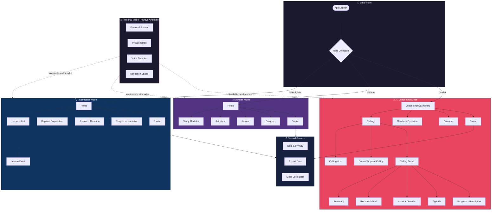

# xTheGospel — UX Master Document

> **Documento definitivo de producto, UX y arquitectura de experiencia**  
> Última actualización: Enero 2026

---

## 1️⃣ DEFINICIÓN CORRECTA Y FINAL

> **Guárdala. Esta es la base de todo el UX.**

```
xTheGospel es una plataforma de acompañamiento espiritual y administrativo
para investigadores, miembros y líderes de la Iglesia local,
que integra discipulado personal, organización eclesiástica y liderazgo responsable
SIN convertir la fe en métricas ni el liderazgo en vigilancia espiritual.
```

### Claves NO Negociables

| ✅ SÍ                                     | ❌ NO                                   |
| ----------------------------------------- | --------------------------------------- |
| Acompaña personas y procesos              | No mide worthiness                      |
| Gestiona llamamientos y responsabilidades | No compara espiritualmente              |
| Permite notas, agendas, diarios, dictado  | No gamifica la fe                       |
| Facilita seguimiento humano               | No convierte progreso espiritual en KPI |

### Identidad del Producto

```
Es un GESTOR de discipulado + gestión eclesiástica
NO solo una app espiritual silenciosa
```

---

## 2️⃣ MODELO UX GLOBAL

### 🧠 Modelo Mental del Usuario

El mismo usuario puede ser:

- Investigador
- Miembro
- Líder
- Obispo

**👉 NO cambia de app. Cambia de MODO.**

Por eso el UX se basa en **MODOS**, no en apps separadas.

---

## 3️⃣ LOS 4 MODOS UX DE xTheGospel

### 🔍 Modo Investigador

| Acciones          | UX          |
| ----------------- | ----------- |
| Aprender          | Guiado      |
| Reflexionar       | Cálido      |
| Prepararse        | Explicativo |
| Diario espiritual | Acompañante |

**Tono:** Acogedor, sin presión, educativo

---

### 🌱 Modo Miembro

| Acciones               | UX              |
| ---------------------- | --------------- |
| Vivir el evangelio     | Acompañante     |
| Estudiar               | No prescriptivo |
| Servir                 | Facilitador     |
| Registrar experiencias | Personal        |

**Tono:** Respetuoso, no impone ritmos

---

### 🧑‍🤝‍🧑 Modo Liderazgo (CORE de lo nuevo)

| Acciones                         | UX        |
| -------------------------------- | --------- |
| Gestionar llamamientos           | Claro     |
| Asignar responsabilidades        | Operativo |
| Dar seguimiento humano           | Humano    |
| Tomar notas                      | Práctico  |
| Agendar entrevistas/seguimientos | Eficiente |

**Reglas críticas:**

- ❌ NO espiritualiza tareas administrativas
- ❌ NO convierte personas en métricas
- ❌ NO crea presión artificial
- ✅ SÍ facilita el servicio real

**Tono:** Profesional, humano, sin vigilancia espiritual

---

### 🧠 Modo Personal (siempre presente)

| Acciones          | UX        |
| ----------------- | --------- |
| Diario espiritual | Íntimo    |
| Notas privadas    | Seguro    |
| Dictado           | Accesible |
| Reflexión         | Sagrado   |

**Este modo NUNCA desaparece**, incluso para obispos.

---

## 4️⃣ WORKFLOW UX GLOBAL (ALTO NIVEL)

```
Inicio
 │
 ├─ Selección / detección de rol
 │
 ├─ 🔍 INVESTIGATOR FLOW
 │   ├─ Home
 │   ├─ Lessons List
 │   ├─ Lesson Detail
 │   ├─ Baptism Preparation
 │   ├─ Journal
 │   ├─ Progress (narrativo)
 │   └─ Profile
 │
 ├─ 🌱 MEMBER FLOW
 │   ├─ Home
 │   ├─ Study Modules
 │   ├─ Activities
 │   ├─ Journal
 │   ├─ Progress
 │   └─ Profile
 │
 └─ 🧑‍🤝‍🧑 LEADERSHIP FLOW
     ├─ Leadership Dashboard
     │   ├─ Active callings
     │   ├─ Callings in training
     │   ├─ Pending callings
     │   └─ Soft alerts (no urgency)
     │
     ├─ Callings
     │   ├─ List (filterable)
     │   ├─ Create / Propose
     │   └─ Calling Detail
     │       ├─ Summary
     │       ├─ Responsibilities
     │       ├─ Notes (dictation)
     │       ├─ Agenda
     │       └─ Progress (descriptivo)
     │
     ├─ Members Overview
     ├─ Calendar
     └─ Profile
```

---

## 5️⃣ DIAGRAMA DE FLUJO UX (MERMAID)



---

## 6️⃣ PANTALLAS REQUERIDAS (INVENTARIO COMPLETO)

### Investigator Flow (7 pantallas)

| #   | Pantalla            | Propósito                         |
| --- | ------------------- | --------------------------------- |
| 1   | Investigator Home   | Dashboard personal de bienvenida  |
| 2   | Lessons List        | Catálogo de lecciones disponibles |
| 3   | Lesson Detail       | Contenido de lección individual   |
| 4   | Baptism Preparation | Preparación para el bautismo      |
| 5   | Journal             | Diario con texto + dictado        |
| 6   | Progress            | Progreso narrativo (no numérico)  |
| 7   | Profile             | Configuración personal            |

### Member Flow (6 pantallas)

| #   | Pantalla      | Propósito              |
| --- | ------------- | ---------------------- |
| 1   | Member Home   | Dashboard de miembro   |
| 2   | Study Modules | Módulos de estudio     |
| 3   | Activities    | Actividades y servicio |
| 4   | Journal       | Diario espiritual      |
| 5   | Progress      | Progreso personal      |
| 6   | Profile       | Configuración          |

### Leadership Flow (12 pantallas)

| #   | Pantalla                          | Propósito                                         |
| --- | --------------------------------- | ------------------------------------------------- |
| 1   | Leadership Dashboard              | Vista general de liderazgo                        |
| 2   | Callings List                     | Lista filtrable de llamamientos                   |
| 3   | Create/Propose Calling            | Crear nuevo llamamiento                           |
| 4   | Calling Detail - Summary          | Resumen del llamamiento                           |
| 5   | Calling Detail - Responsibilities | Responsabilidades asignadas                       |
| 6   | Calling Detail - Notes            | Notas con dictado                                 |
| 7   | Calling Detail - Agenda           | Calendario del llamamiento                        |
| 8   | Calling Detail - Progress         | Progreso descriptivo                              |
| 9   | Responsibilities List             | Lista de responsabilidades                        |
| 10  | Create Responsibility             | Crear responsabilidad                             |
| 11  | Member Overview                   | Vista de miembro (llamamientos, notas, historial) |
| 12  | Leadership Calendar               | Calendario mensual/semanal                        |

### Shared (3 pantallas)

| #   | Pantalla          | Propósito                   |
| --- | ----------------- | --------------------------- |
| 1   | Profile           | Perfil unificado            |
| 2   | Data & Privacy    | Configuración de privacidad |
| 3   | Export/Clear Data | Exportar o limpiar datos    |

**Total: 28 pantallas únicas**

---

## 7️⃣ PROMPT MAESTRO PARA UX PILOT

> **Copia este prompt completo y pégalo en UX Pilot**

```
You are UX Pilot.

Project name: xTheGospel

Goal:
Design the full UX workflow and wireframes for a Progressive Web App (PWA)
that supports spiritual growth and church leadership management
for investigators, members, and local church leaders.

This is NOT a gamified app.
This is NOT a social network.
This is NOT a performance-tracking system.

Core principle:
The app accompanies people and processes without judging spiritual worthiness.

--------------------------------------------------
USER MODES (NOT SEPARATE APPS):

1. Investigator - Learning and preparing for baptism
2. Member - Living the gospel, studying, serving
3. Leader (ward/stake leadership) - Managing callings and responsibilities
4. Personal mode (journal, notes, dictation) - Always available in all modes

--------------------------------------------------
GLOBAL UX RULES:

- No streaks
- No scores
- No percentages
- No rankings
- No "spiritual KPIs"
- No guilt-inducing messages
- No "you've been away for X days"
- Clear, calm, respectful tone
- Administrative clarity without spiritual pressure
- Progress is NARRATIVE, not numeric
- Leadership tools facilitate service, not surveillance

--------------------------------------------------
SCREENS TO DESIGN (ALL REQUIRED):

### INVESTIGATOR FLOW (7 screens)
- Investigator Home
  - Welcome message
  - Continue where you left off
  - Quick access to lessons
  - Journal entry point

- Lessons List
  - Categorized lessons
  - Visual progress indicators (non-numeric)
  - Search/filter

- Lesson Detail
  - Rich content display
  - Scripture references
  - Reflection prompts
  - Save to journal action

- Baptism Preparation
  - Covenant understanding
  - Interview preparation
  - Questions section

- Journal (text + voice dictation)
  - Text entry
  - Voice dictation button
  - Date organization
  - Private by default

- Progress (non-numeric, narrative)
  - Journey milestones (not percentages)
  - Personal reflections
  - Key moments recorded

- Profile
  - Personal settings
  - Language preference
  - Data & privacy access

### MEMBER FLOW (6 screens)
- Member Home
  - Personalized dashboard
  - Current callings summary
  - Study suggestions
  - Service opportunities

- Study Modules
  - Scripture study
  - Gospel topics
  - Personal study plans

- Activities
  - Ward activities
  - Service opportunities
  - Personal commitments

- Journal
  - Personal spiritual journal
  - Voice dictation
  - Tagging system

- Progress
  - Personal growth narrative
  - Goals and reflections
  - No comparisons

- Profile
  - Settings
  - Callings history
  - Data management

### LEADERSHIP FLOW (12 screens) - CORE FOCUS
- Leadership Dashboard
  - Active callings count
  - Callings in training
  - Pending callings
  - Soft alerts (gentle reminders, no urgency)
  - Quick actions

- Callings List
  - Filter by organization (Primary, Relief Society, Elders Quorum, etc.)
  - Status: Proposed / Active / In Training / Released
  - Search functionality
  - Sort options

- Create / Propose Calling
  - Member selection
  - Organization dropdown
  - Role/Position
  - Proposed date
  - Notes field
  - Submit for approval

- Calling Detail (Tabbed View with 5 tabs)

  Tab 1: Summary
  - Member name and photo
  - Calling title
  - Organization
  - Start date
  - Status
  - Quick actions

  Tab 2: Responsibilities / Assignments
  - List of responsibilities
  - Add new responsibility
  - Mark as discussed
  - Due dates (optional)

  Tab 3: Notes (with voice dictation)
  - Chronological notes
  - Voice dictation input
  - Private to leader
  - Timestamps

  Tab 4: Agenda / Calendar
  - Scheduled meetings
  - Training sessions
  - Follow-up dates
  - Add new event

  Tab 5: Progress (descriptive, not numeric)
  - Narrative updates
  - Key milestones
  - Observations
  - NO percentages or scores

- Responsibilities List
  - All responsibilities across callings
  - Filter by organization
  - Status indicators

- Create Responsibility
  - Title
  - Description
  - Assigned to (calling)
  - Optional due date
  - Notes

- Member Overview
  - Member profile
  - Current callings
  - Past callings
  - Leader notes (private)
  - Service history summary

- Leadership Calendar (monthly / weekly)
  - All leadership events
  - Interviews scheduled
  - Training sessions
  - Ward council meetings
  - Filter by organization

### SHARED SCREENS (3 screens)
- Profile
  - Personal information
  - Role/mode switcher
  - Preferences

- Data & Privacy
  - What data is stored
  - Local vs synced
  - Consent management

- Export / Clear Data
  - Export personal data
  - Clear local data
  - Account management

--------------------------------------------------
NAVIGATION STRUCTURE:

Bottom Navigation (4 items max):
- Home (context-aware per mode)
- [Mode-specific: Lessons/Study/Dashboard]
- Journal
- Profile

Mode Switcher:
- Accessible from Profile
- Or floating action button
- Smooth transition between modes

--------------------------------------------------
DELIVERABLES:

1. Full UX workflow diagram showing all user flows
2. Low-fidelity wireframes for ALL 28 screens
3. Clear navigation structure with mode switching
4. Layout consistency across modes
5. Responsive design considerations (mobile-first PWA)
6. Ready for export to Figma Make

--------------------------------------------------
VISUAL STYLE (WIREFRAME LEVEL):

- Clean and uncluttered
- Structured with clear hierarchy
- Human and approachable
- Calm color suggestions (no harsh contrasts)
- No decorative overload
- Consistent spacing and typography
- Clear call-to-action buttons
- Accessible design patterns

--------------------------------------------------
IMPORTANT CONSTRAINTS:

1. Leadership tools must feel ADMINISTRATIVE, not spiritual surveillance
2. Progress indicators must be NARRATIVE, not numeric
3. No gamification elements whatsoever
4. Personal mode (journal) must be available in ALL modes
5. Mode switching must be seamless and intuitive
6. All data handling must respect privacy (local-first)

--------------------------------------------------

Generate the complete UX workflow and wireframes now.
Start with the workflow diagram, then proceed to wireframes for each flow.
```

---

## 8️⃣ SIGUIENTE PASO (ORDEN CORRECTO)

1. ✅ **Pega el prompt en UX Pilot**
2. ⏳ **Genera el workflow completo**
3. ⏳ **Exporta a Figma Make**
4. ⏳ **Revisión conjunta:**
   - Flujos
   - Pantallas
   - Jerarquía
5. ⏳ **UI tokens + componentes reales**

---

## 9️⃣ MAPEO CON CÓDIGO EXISTENTE

El proyecto ya tiene implementaciones parciales que se alinean con este modelo:

### Investigator (existente)

- `src/modules/investigator/` - Módulo completo
- `src/pages/learning/` - Páginas de aprendizaje
- `src/pages/investigator/` - Home y Profile

### Member (existente)

- `src/pages/member/` - 37 archivos
- `src/member/` - Componentes y datos

### Leadership (implementado)

- `src/features/leadershipCallings/` - Módulo completo: dashboard, llamamientos, calendario, miembros, responsabilidades, notas, tabs en detalle de llamamiento

### Shared (existente)

- `src/components/DataPrivacySection.tsx`
- `src/core/export/` - Exportación de datos

---

## 🔐 REFERENCIA: ETHICAL BOUNDARIES

Este documento UX debe leerse junto con `docs/ETHICAL_BOUNDARIES.md`.

**Regla de oro:**

> "Un usuario en un momento espiritual vulnerable  
> debe sentirse **servido**, no **vigilado**,  
> por esta aplicación."

---

_Documento creado para xTheGospel — Enero 2026_
