# xTheGospel — UX Wireframes & Workflow

> **UX Pilot Output — Complete Deliverable**  
> 28 Screens • 4 Modes • Full Navigation System

---

## 📐 DELIVERABLE 1: UX WORKFLOW DIAGRAM

```mermaid
flowchart TB
    subgraph Entry["🚪 ENTRY"]
        Launch([App Launch]) --> Splash[Splash Screen]
        Splash --> StageCheck{Stage Detection}
    end

    subgraph Investigator["🔍 INVESTIGATOR MODE"]
        StageCheck -->|seeking| IHome["📱 Investigator Home"]
        
        IHome --> ILessons["📚 Lessons List"]
        ILessons --> ILessonDetail["📖 Lesson Detail"]
        ILessonDetail --> ISaveJournal["💾 Save to Journal"]
        
        IHome --> IBaptism["🌊 Baptism Prep"]
        IHome --> IProgress["📈 Progress (Narrative)"]
        IHome --> IJournal["✍️ Journal"]
        IHome --> IProfile["👤 Profile"]
    end

    subgraph Member["🌱 MEMBER MODE"]
        StageCheck -->|covenanted/established| MHome["📱 Member Home"]
        
        MHome --> MStudy["📚 Study Modules"]
        MStudy --> MStudyDetail["📖 Module Detail"]
        
        MHome --> MActivities["🎯 Activities"]
        MActivities --> MActivityDetail["📋 Activity Detail"]
        
        MHome --> MProgress["📈 Progress"]
        MHome --> MJournal["✍️ Journal"]
        MHome --> MProfile["👤 Profile"]
    end

    subgraph Leadership["🧑‍💼 LEADERSHIP MODE"]
        MHome -->|has leadership role| LDash["📊 Leadership Dashboard"]
        
        LDash --> LCallings["📋 Callings List"]
        LCallings --> LNewCalling["➕ Create Calling"]
        LCallings --> LCallingDetail["📄 Calling Detail"]
        
        LCallingDetail --> LCSummary["Summary Tab"]
        LCallingDetail --> LCResponsibilities["Responsibilities Tab"]
        LCallingDetail --> LCNotes["Notes Tab"]
        LCallingDetail --> LCAgenda["Agenda Tab"]
        LCallingDetail --> LCProgress["Progress Tab"]
        
        LCResponsibilities --> LNewResp["➕ New Responsibility"]
        
        LDash --> LMembers["👥 Members"]
        LMembers --> LMemberDetail["👤 Member Overview"]
        
        LDash --> LCalendar["📅 Calendar"]
        
        LCallingDetail --> LRelease["🔓 Release Calling"]
    end

    subgraph Personal["🧠 PERSONAL MODE (Universal)"]
        Journal["✍️ Journal + Dictation"]
        PrivateNotes["🔒 Private Notes"]
    end

    subgraph Shared["⚙️ SHARED"]
        Profile["👤 Profile"]
        DataPrivacy["🔐 Data & Privacy"]
        Export["📤 Export Data"]
        ClearData["🗑️ Clear Data"]
        
        Profile --> DataPrivacy
        DataPrivacy --> Export
        DataPrivacy --> ClearData
    end

    %% Cross-mode connections
    IJournal -.-> Journal
    MJournal -.-> Journal
    IProfile -.-> Profile
    MProfile -.-> Profile

    style Entry fill:#0d1117,stroke:#30363d,color:#c9d1d9
    style Investigator fill:#161b22,stroke:#1f6feb,color:#c9d1d9
    style Member fill:#161b22,stroke:#238636,color:#c9d1d9
    style Leadership fill:#161b22,stroke:#a371f7,color:#c9d1d9
    style Personal fill:#21262d,stroke:#f78166,color:#c9d1d9
    style Shared fill:#21262d,stroke:#8b949e,color:#c9d1d9
```



---

## 📐 DELIVERABLE 2: NAVIGATION STRUCTURE

### Global Navigation Pattern

```
┌─────────────────────────────────────────────────────────────┐
│  HEADER (contextual)                                        │
│  ┌─────────────────────────────────────────────────────────┐│
│  │ [←] Page Title                    [Mode] [Profile Icon] ││
│  └─────────────────────────────────────────────────────────┘│
├─────────────────────────────────────────────────────────────┤
│                                                             │
│                     CONTENT AREA                            │
│                     (scrollable)                            │
│                                                             │
├─────────────────────────────────────────────────────────────┤
│  BOTTOM NAVIGATION                                          │
│  ┌─────────────────────────────────────────────────────────┐│
│  │   Home    │   [Context]   │   Journal   │   Profile     ││
│  │    🏠     │      📚       │      ✍️      │      👤       ││
│  └─────────────────────────────────────────────────────────┘│
└─────────────────────────────────────────────────────────────┘
```

### Bottom Nav by Mode

| Mode | Tab 1 | Tab 2 | Tab 3 | Tab 4 |
|------|-------|-------|-------|-------|
| **Investigator** | Home | Lessons | Journal | Profile |
| **Member** | Home | Study | Journal | Profile |
| **Leadership** | Dashboard | Callings | Calendar | Profile |

### Mode Switcher Location
- Inside Profile screen
- Floating button (optional)
- Persistent in header (for leaders)

---

## 📐 DELIVERABLE 3: LAYOUT SYSTEM

### Base Layout Component

```
┌──────────────────────────────────────┐
│           SAFE AREA TOP              │
├──────────────────────────────────────┤
│                                      │
│           HEADER SLOT                │
│         (48-56px height)             │
│                                      │
├──────────────────────────────────────┤
│                                      │
│                                      │
│           CONTENT SLOT               │
│         (flex: 1, scroll)            │
│                                      │
│                                      │
│                                      │
├──────────────────────────────────────┤
│                                      │
│           BOTTOM NAV SLOT            │
│           (56-64px height)           │
│                                      │
├──────────────────────────────────────┤
│          SAFE AREA BOTTOM            │
└──────────────────────────────────────┘
```

### Spacing System

| Token | Value | Usage |
|-------|-------|-------|
| `space-xs` | 4px | Tight gaps |
| `space-sm` | 8px | Related elements |
| `space-md` | 16px | Standard gaps |
| `space-lg` | 24px | Section separation |
| `space-xl` | 32px | Major sections |
| `space-2xl` | 48px | Page-level padding |

### Typography Scale

| Token | Size | Weight | Usage |
|-------|------|--------|-------|
| `text-xs` | 12px | 400 | Captions, metadata |
| `text-sm` | 14px | 400 | Secondary text |
| `text-base` | 16px | 400 | Body text |
| `text-lg` | 18px | 500 | Subtitles |
| `text-xl` | 20px | 600 | Section headers |
| `text-2xl` | 24px | 700 | Page titles |
| `text-3xl` | 30px | 700 | Hero text |

---

## 📐 DELIVERABLE 4: WIREFRAMES (ALL 28 SCREENS)

---

# A) INVESTIGATOR FLOW (7 Screens)

---

## Screen 1: Investigator Home
**Route:** `/home` (when stage=seeking)

```
┌──────────────────────────────────────┐
│  xTheGospel              [🌙] [👤]   │
├──────────────────────────────────────┤
│                                      │
│  ┌────────────────────────────────┐  │
│  │                                │  │
│  │    Buenos días, [Nombre]       │  │
│  │                                │  │
│  │    Continúa tu camino          │  │
│  │    de descubrimiento           │  │
│  │                                │  │
│  └────────────────────────────────┘  │
│                                      │
│  ┌────────────────────────────────┐  │
│  │  📖 Continuar donde dejaste    │  │
│  │  ─────────────────────────────│  │
│  │  Lección 3: La Restauración    │  │
│  │                          [→]   │  │
│  └────────────────────────────────┘  │
│                                      │
│  Próximos pasos                      │
│  ┌──────────┐ ┌──────────┐          │
│  │  📚      │ │  ✍️      │          │
│  │ Lecciones│ │ Diario   │          │
│  │          │ │          │          │
│  └──────────┘ └──────────┘          │
│  ┌──────────┐ ┌──────────┐          │
│  │  🌊      │ │  📈      │          │
│  │ Bautismo │ │ Mi camino│          │
│  │          │ │          │          │
│  └──────────┘ └──────────┘          │
│                                      │
│  ┌────────────────────────────────┐  │
│  │  💡 Reflexión del día          │  │
│  │  ─────────────────────────────│  │
│  │  "Venid a mí todos los que    │  │
│  │   estáis trabajados..."       │  │
│  │            — Mateo 11:28      │  │
│  └────────────────────────────────┘  │
│                                      │
├──────────────────────────────────────┤
│   🏠      │    📚     │   ✍️    │ 👤 │
│  Inicio   │ Lecciones │ Diario  │    │
└──────────────────────────────────────┘
```

**Components:**
- Welcome card (personalized, warm)
- Continue lesson card
- Quick action grid (2x2)
- Daily reflection card
- Bottom navigation

---

## Screen 2: Lessons List
**Route:** `/lessons`

```
┌──────────────────────────────────────┐
│  [←]  Lecciones                 [🔍] │
├──────────────────────────────────────┤
│                                      │
│  Tu progreso                         │
│  ┌────────────────────────────────┐  │
│  │  ○ ─ ○ ─ ● ─ ○ ─ ○ ─ ○        │  │
│  │  Lección 3 de 6               │  │
│  └────────────────────────────────┘  │
│                                      │
│  ┌────────────────────────────────┐  │
│  │  [✓] Lección 1                 │  │
│  │  ────────────────────────────  │  │
│  │  El Plan de Salvación          │  │
│  │  Aprendiste sobre el propósito │  │
│  │  de la vida.                   │  │
│  │                          [→]   │  │
│  └────────────────────────────────┘  │
│                                      │
│  ┌────────────────────────────────┐  │
│  │  [✓] Lección 2                 │  │
│  │  ────────────────────────────  │  │
│  │  El Evangelio de Jesucristo    │  │
│  │  Fe, arrepentimiento y más.    │  │
│  │                          [→]   │  │
│  └────────────────────────────────┘  │
│                                      │
│  ┌────────────────────────────────┐  │
│  │  [●] Lección 3                 │  │
│  │  ────────────────────────────  │  │
│  │  La Restauración               │  │
│  │  En progreso                   │  │
│  │                          [→]   │  │
│  └────────────────────────────────┘  │
│                                      │
│  ┌────────────────────────────────┐  │
│  │  [ ] Lección 4                 │  │
│  │  ────────────────────────────  │  │
│  │  Mandamientos                  │  │
│  │  Próximamente                  │  │
│  │                          [→]   │  │
│  └────────────────────────────────┘  │
│                                      │
├──────────────────────────────────────┤
│   🏠      │    📚     │   ✍️    │ 👤 │
└──────────────────────────────────────┘
```

**Components:**
- Progress indicator (dots, not percentage)
- Lesson cards with state: completed ✓, in progress ●, upcoming ○
- No numeric scores

---

## Screen 3: Lesson Detail
**Route:** `/lessons/:lessonId`

```
┌──────────────────────────────────────┐
│  [←]  Lección 3                      │
├──────────────────────────────────────┤
│                                      │
│  ┌────────────────────────────────┐  │
│  │                                │  │
│  │     [   IMAGEN / VIDEO   ]    │  │
│  │                                │  │
│  └────────────────────────────────┘  │
│                                      │
│  La Restauración del                 │
│  Evangelio de Jesucristo             │
│  ─────────────────────────────────   │
│                                      │
│  Después de siglos de oscuridad      │
│  espiritual, Dios el Padre y su      │
│  Hijo Jesucristo aparecieron a       │
│  José Smith...                       │
│                                      │
│  ┌────────────────────────────────┐  │
│  │  📖 Escritura relacionada      │  │
│  │  ─────────────────────────────│  │
│  │  "...ésta es satisfacer mi    │  │
│  │   propia curiosidad y         │  │
│  │   saber de todas las sectas   │  │
│  │   cuál era la verdadera..."   │  │
│  │        — José Smith Historia  │  │
│  └────────────────────────────────┘  │
│                                      │
│  ┌────────────────────────────────┐  │
│  │  💭 Para reflexionar           │  │
│  │  ─────────────────────────────│  │
│  │  ¿Alguna vez has sentido que  │  │
│  │  hay verdades espirituales    │  │
│  │  que aún no comprendes?       │  │
│  │                               │  │
│  │  [    Escribir en diario    ] │  │
│  └────────────────────────────────┘  │
│                                      │
│  ┌────────────────────────────────┐  │
│  │                                │  │
│  │  [  ← Anterior  ] [Siguiente →]│  │
│  │                                │  │
│  └────────────────────────────────┘  │
│                                      │
├──────────────────────────────────────┤
│   🏠      │    📚     │   ✍️    │ 👤 │
└──────────────────────────────────────┘
```

**Components:**
- Media area (image/video)
- Rich text content
- Scripture reference card
- Reflection prompt
- "Write to journal" CTA
- Lesson navigation

---

## Screen 4: Baptism Preparation
**Route:** `/baptism`

```
┌──────────────────────────────────────┐
│  [←]  Preparación para el Bautismo   │
├──────────────────────────────────────┤
│                                      │
│  ┌────────────────────────────────┐  │
│  │                                │  │
│  │   🌊                           │  │
│  │   El convenio del bautismo     │  │
│  │                                │  │
│  │   Un paso de fe y compromiso   │  │
│  │                                │  │
│  └────────────────────────────────┘  │
│                                      │
│  Tu preparación                      │
│                                      │
│  ┌────────────────────────────────┐  │
│  │  ○  Entender el convenio       │  │
│  │     Qué significa el bautismo  │  │
│  │                          [→]   │  │
│  └────────────────────────────────┘  │
│                                      │
│  ┌────────────────────────────────┐  │
│  │  ○  Preparación personal       │  │
│  │     Reflexiones y preguntas    │  │
│  │                          [→]   │  │
│  └────────────────────────────────┘  │
│                                      │
│  ┌────────────────────────────────┐  │
│  │  ○  La entrevista              │  │
│  │     Qué esperar                │  │
│  │                          [→]   │  │
│  └────────────────────────────────┘  │
│                                      │
│  ┌────────────────────────────────┐  │
│  │  ○  Después del bautismo       │  │
│  │     Tu nueva vida de convenio  │  │
│  │                          [→]   │  │
│  └────────────────────────────────┘  │
│                                      │
│  ┌────────────────────────────────┐  │
│  │  💬 ¿Tienes preguntas?         │  │
│  │  ─────────────────────────────│  │
│  │  Escríbelas aquí para hablar  │  │
│  │  con los misioneros.          │  │
│  │                               │  │
│  │  [   Escribir pregunta    ]   │  │
│  └────────────────────────────────┘  │
│                                      │
├──────────────────────────────────────┤
│   🏠      │    📚     │   ✍️    │ 👤 │
└──────────────────────────────────────┘
```

**Components:**
- Hero section with icon
- Preparation checklist (non-mandatory)
- Expandable sections
- Questions capture area
- No pressure language

---

## Screen 5: Journal (Investigator)
**Route:** `/journal`

```
┌──────────────────────────────────────┐
│  [←]  Mi Diario                 [+]  │
├──────────────────────────────────────┤
│                                      │
│  ┌────────────────────────────────┐  │
│  │  Nueva entrada                 │  │
│  │  ─────────────────────────────│  │
│  │                               │  │
│  │  [                          ] │  │
│  │  [    Escribe aquí...       ] │  │
│  │  [                          ] │  │
│  │                               │  │
│  │  [🎤 Dictar]    [💾 Guardar]  │  │
│  └────────────────────────────────┘  │
│                                      │
│  ─────────────────────────────────   │
│  Entradas anteriores                 │
│  ─────────────────────────────────   │
│                                      │
│  ┌────────────────────────────────┐  │
│  │  📅 Hoy                        │  │
│  │  ─────────────────────────────│  │
│  │  "Hoy aprendí sobre la        │  │
│  │   restauración. Me sentí      │  │
│  │   en paz al leer sobre..."    │  │
│  │                               │  │
│  │  📖 Relacionado: Lección 3    │  │
│  └────────────────────────────────┘  │
│                                      │
│  ┌────────────────────────────────┐  │
│  │  📅 Ayer                       │  │
│  │  ─────────────────────────────│  │
│  │  "Los misioneros me visitaron │  │
│  │   y compartieron un mensaje   │  │
│  │   sobre la fe..."             │  │
│  └────────────────────────────────┘  │
│                                      │
│  ┌────────────────────────────────┐  │
│  │  📅 23 de enero               │  │
│  │  ─────────────────────────────│  │
│  │  "Mi primera oración. No      │  │
│  │   sabía qué decir pero..."    │  │
│  └────────────────────────────────┘  │
│                                      │
├──────────────────────────────────────┤
│   🏠      │    📚     │   ✍️    │ 👤 │
└──────────────────────────────────────┘
```

**Components:**
- New entry area (text + dictation)
- Voice dictation button (🎤)
- Chronological entries list
- Entry cards with preview
- Lesson/source tags
- Private by default (no sync indicator)

---

## Screen 6: Progress (Investigator)
**Route:** `/progress`

```
┌──────────────────────────────────────┐
│  [←]  Mi Camino                      │
├──────────────────────────────────────┤
│                                      │
│  ┌────────────────────────────────┐  │
│  │                                │  │
│  │       Tu camino es único       │  │
│  │                                │  │
│  │   No hay prisa. Cada paso      │  │
│  │   que das tiene valor.         │  │
│  │                                │  │
│  └────────────────────────────────┘  │
│                                      │
│  Momentos importantes                │
│                                      │
│  ┌────────────────────────────────┐  │
│  │  ●───────────────────────○     │  │
│  │                                │  │
│  │  ┌─────┐                       │  │
│  │  │ 🌱  │  Comenzaste tu camino │  │
│  │  │     │  15 de enero          │  │
│  │  └─────┘                       │  │
│  │      │                         │  │
│  │      │                         │  │
│  │  ┌─────┐                       │  │
│  │  │ 📖  │  Primera lección      │  │
│  │  │     │  17 de enero          │  │
│  │  └─────┘                       │  │
│  │      │                         │  │
│  │      │                         │  │
│  │  ┌─────┐                       │  │
│  │  │ 🙏  │  Primera oración      │  │
│  │  │     │  19 de enero          │  │
│  │  └─────┘                       │  │
│  │      │                         │  │
│  │      ⋮                         │  │
│  │      │                         │  │
│  │  ┌─────┐                       │  │
│  │  │ 🌊  │  Preparación bautismo │  │
│  │  │     │  Cuando estés listo   │  │
│  │  └─────┘                       │  │
│  │                                │  │
│  └────────────────────────────────┘  │
│                                      │
│  ┌────────────────────────────────┐  │
│  │  ✍️ Añadir un momento          │  │
│  └────────────────────────────────┘  │
│                                      │
├──────────────────────────────────────┤
│   🏠      │    📚     │   ✍️    │ 👤 │
└──────────────────────────────────────┘
```

**Components:**
- Encouraging header (no pressure)
- Visual timeline (not percentage)
- Milestone cards with icons and dates
- "Add moment" CTA
- NO: scores, percentages, comparisons

---

## Screen 7: Profile (Investigator)
**Route:** `/profile`

```
┌──────────────────────────────────────┐
│       Mi Perfil                      │
├──────────────────────────────────────┤
│                                      │
│         ┌─────────┐                  │
│         │         │                  │
│         │   👤    │                  │
│         │         │                  │
│         └─────────┘                  │
│           [Nombre]                   │
│         Investigador                 │
│                                      │
│  ─────────────────────────────────   │
│                                      │
│  ┌────────────────────────────────┐  │
│  │  🌐  Idioma                    │  │
│  │      Español                [→]│  │
│  └────────────────────────────────┘  │
│                                      │
│  ┌────────────────────────────────┐  │
│  │  🌙  Tema                      │  │
│  │      Oscuro                 [→]│  │
│  └────────────────────────────────┘  │
│                                      │
│  ┌────────────────────────────────┐  │
│  │  🔔  Notificaciones            │  │
│  │      Desactivadas           [→]│  │
│  └────────────────────────────────┘  │
│                                      │
│  ─────────────────────────────────   │
│  Privacidad                          │
│  ─────────────────────────────────   │
│                                      │
│  ┌────────────────────────────────┐  │
│  │  🔐  Datos y Privacidad        │  │
│  │      Ver qué datos existen  [→]│  │
│  └────────────────────────────────┘  │
│                                      │
│  ┌────────────────────────────────┐  │
│  │  📤  Exportar mis datos        │  │
│  │                             [→]│  │
│  └────────────────────────────────┘  │
│                                      │
│  ┌────────────────────────────────┐  │
│  │  🗑️  Borrar datos locales      │  │
│  │                             [→]│  │
│  └────────────────────────────────┘  │
│                                      │
├──────────────────────────────────────┤
│   🏠      │    📚     │   ✍️    │ 👤 │
└──────────────────────────────────────┘
```

**Components:**
- Avatar placeholder
- Role indicator
- Settings sections
- Privacy section (prominent)
- Data management options

---

# B) MEMBER FLOW (8 Screens)

---

## Screen 8: Member Home
**Route:** `/home` (when stage=covenanted/established)

```
┌──────────────────────────────────────┐
│  xTheGospel              [🌙] [👤]   │
├──────────────────────────────────────┤
│                                      │
│  ┌────────────────────────────────┐  │
│  │                                │  │
│  │    Bienvenido, [Nombre]        │  │
│  │                                │  │
│  │    "Sed pues vosotros          │  │
│  │     perfectos..."              │  │
│  │              — Mateo 5:48      │  │
│  │                                │  │
│  └────────────────────────────────┘  │
│                                      │
│  ┌────────────────────────────────┐  │
│  │  📖 Continuar estudio          │  │
│  │  ─────────────────────────────│  │
│  │  Ven Sígueme: Doctrina y...   │  │
│  │                          [→]   │  │
│  └────────────────────────────────┘  │
│                                      │
│  Tu servicio                         │
│  ┌────────────────────────────────┐  │
│  │  Llamamientos actuales         │  │
│  │  ─────────────────────────────│  │
│  │  • Maestro de EQ              │  │
│  │  • Ministro asignado (3)      │  │
│  │                          [→]   │  │
│  └────────────────────────────────┘  │
│                                      │
│  Acceso rápido                       │
│  ┌──────────┐ ┌──────────┐          │
│  │  📚      │ │  🎯      │          │
│  │ Estudiar │ │Actividades│          │
│  └──────────┘ └──────────┘          │
│  ┌──────────┐ ┌──────────┐          │
│  │  ✍️      │ │  📈      │          │
│  │ Diario   │ │ Mi camino│          │
│  └──────────┘ └──────────┘          │
│                                      │
│  ┌────────────────────────────────┐  │
│  │  🧑‍💼 Acceso de Liderazgo        │  │
│  │  Tienes rol de líder        [→]│  │
│  └────────────────────────────────┘  │
│                                      │
├──────────────────────────────────────┤
│   🏠      │    📚     │   ✍️    │ 👤 │
│  Inicio   │  Estudiar │ Diario  │    │
└──────────────────────────────────────┘
```

**Components:**
- Welcome card with scripture
- Continue study card
- Current callings summary
- Quick action grid
- Leadership access (if applicable)

---

## Screen 9: Study Modules
**Route:** `/member/study`

```
┌──────────────────────────────────────┐
│  [←]  Estudio                   [🔍] │
├──────────────────────────────────────┤
│                                      │
│  ┌─────────────────────────────────┐ │
│  │ [Ven Sígueme] [Temas] [Escrituras]│
│  └─────────────────────────────────┘ │
│                                      │
│  Ven, Sígueme 2026                   │
│                                      │
│  ┌────────────────────────────────┐  │
│  │  ┌────┐                        │  │
│  │  │ 📖 │  Esta semana           │  │
│  │  └────┘  ─────────────────────│  │
│  │          1 Nefi 1-5            │  │
│  │          "Iré y haré"          │  │
│  │                          [→]   │  │
│  └────────────────────────────────┘  │
│                                      │
│  ┌────────────────────────────────┐  │
│  │  ┌────┐                        │  │
│  │  │ 📖 │  Semana anterior       │  │
│  │  └────┘  ─────────────────────│  │
│  │          Introducción al       │  │
│  │          Libro de Mormón       │  │
│  │                          [→]   │  │
│  └────────────────────────────────┘  │
│                                      │
│  Temas de estudio                    │
│                                      │
│  ┌────────────────────────────────┐  │
│  │  ┌────┐                        │  │
│  │  │ 🙏 │  La oración            │  │
│  │  └────┘  Aprende sobre la      │  │
│  │          comunicación con Dios │  │
│  │                          [→]   │  │
│  └────────────────────────────────┘  │
│                                      │
│  ┌────────────────────────────────┐  │
│  │  ┌────┐                        │  │
│  │  │ 💪 │  La fe en Cristo       │  │
│  │  └────┘  Fundamento del        │  │
│  │          evangelio             │  │
│  │                          [→]   │  │
│  └────────────────────────────────┘  │
│                                      │
├──────────────────────────────────────┤
│   🏠      │    📚     │   ✍️    │ 👤 │
└──────────────────────────────────────┘
```

**Components:**
- Tab filter (Come Follow Me, Topics, Scriptures)
- Current week study card (highlighted)
- Previous weeks
- Topic cards
- Search functionality

---

## Screen 10: Study Module Detail
**Route:** `/member/study/:moduleId`

```
┌──────────────────────────────────────┐
│  [←]  1 Nefi 1-5                     │
├──────────────────────────────────────┤
│                                      │
│  ┌────────────────────────────────┐  │
│  │                                │  │
│  │     [   IMAGEN / VIDEO   ]    │  │
│  │                                │  │
│  └────────────────────────────────┘  │
│                                      │
│  "Iré y haré"                        │
│  ─────────────────────────────────   │
│  Enero 27 - Febrero 2                │
│                                      │
│  ┌────────────────────────────────┐  │
│  │  📖 Lectura de la semana       │  │
│  │  ─────────────────────────────│  │
│  │  1 Nefi 1-5                    │  │
│  │                                │  │
│  │  [  Abrir en escrituras   ]   │  │
│  └────────────────────────────────┘  │
│                                      │
│  Ideas para el estudio               │
│                                      │
│  ┌────────────────────────────────┐  │
│  │  💡 Dios prepara el camino     │  │
│  │  ─────────────────────────────│  │
│  │  Lehi fue guiado por Dios     │  │
│  │  para sacar a su familia de   │  │
│  │  Jerusalén antes de su        │  │
│  │  destrucción...               │  │
│  │                               │  │
│  │  [Leer más]                   │  │
│  └────────────────────────────────┘  │
│                                      │
│  ┌────────────────────────────────┐  │
│  │  💭 Para reflexionar           │  │
│  │  ─────────────────────────────│  │
│  │  ¿Cuándo has sentido que      │  │
│  │  Dios te ha preparado el      │  │
│  │  camino?                      │  │
│  │                               │  │
│  │  [   Escribir en diario   ]   │  │
│  └────────────────────────────────┘  │
│                                      │
├──────────────────────────────────────┤
│   🏠      │    📚     │   ✍️    │ 👤 │
└──────────────────────────────────────┘
```

---

## Screen 11: Activities
**Route:** `/member/activities`

```
┌──────────────────────────────────────┐
│  [←]  Actividades               [+]  │
├──────────────────────────────────────┤
│                                      │
│  ┌─────────────────────────────────┐ │
│  │ [Próximas] [Mis compromisos]    │ │
│  └─────────────────────────────────┘ │
│                                      │
│  Esta semana                         │
│                                      │
│  ┌────────────────────────────────┐  │
│  │  📅 Miércoles 28               │  │
│  │  ─────────────────────────────│  │
│  │  🎯 Noche de hogar del barrio  │  │
│  │     7:00 PM - Centro de reuniones│
│  │                                │  │
│  │  [Ver detalles]                │  │
│  └────────────────────────────────┘  │
│                                      │
│  ┌────────────────────────────────┐  │
│  │  📅 Sábado 31                  │  │
│  │  ─────────────────────────────│  │
│  │  🤝 Servicio comunitario       │  │
│  │     9:00 AM - Parque Central   │  │
│  │                                │  │
│  │  [Ver detalles]                │  │
│  └────────────────────────────────┘  │
│                                      │
│  Próxima semana                      │
│                                      │
│  ┌────────────────────────────────┐  │
│  │  📅 Domingo 1 Feb              │  │
│  │  ─────────────────────────────│  │
│  │  ⛪ Reunión sacramental        │  │
│  │     10:00 AM                   │  │
│  └────────────────────────────────┘  │
│                                      │
│  Mis compromisos personales          │
│                                      │
│  ┌────────────────────────────────┐  │
│  │  ○  Visitar a la familia García│  │
│  │  ○  Preparar lección de EQ     │  │
│  │  ●  Llamar al hermano López    │  │
│  │                                │  │
│  │  [+ Añadir compromiso]         │  │
│  └────────────────────────────────┘  │
│                                      │
├──────────────────────────────────────┤
│   🏠      │    📚     │   ✍️    │ 👤 │
└──────────────────────────────────────┘
```

---

## Screen 12: Activity Detail
**Route:** `/member/activities/:activityId`

```
┌──────────────────────────────────────┐
│  [←]  Detalle de Actividad           │
├──────────────────────────────────────┤
│                                      │
│  ┌────────────────────────────────┐  │
│  │                                │  │
│  │   🎯                           │  │
│  │   Noche de hogar del barrio    │  │
│  │                                │  │
│  └────────────────────────────────┘  │
│                                      │
│  ┌────────────────────────────────┐  │
│  │  📅 Fecha                      │  │
│  │     Miércoles, 28 de enero     │  │
│  │     7:00 PM - 8:30 PM          │  │
│  └────────────────────────────────┘  │
│                                      │
│  ┌────────────────────────────────┐  │
│  │  📍 Lugar                      │  │
│  │     Centro de reuniones        │  │
│  │     Calle Principal 123        │  │
│  │                                │  │
│  │  [  Ver en mapa  ]            │  │
│  └────────────────────────────────┘  │
│                                      │
│  ┌────────────────────────────────┐  │
│  │  📝 Descripción                │  │
│  │  ─────────────────────────────│  │
│  │  Actividad para todas las     │  │
│  │  familias del barrio. Habrá   │  │
│  │  música, juegos y refrigerios.│  │
│  │                                │  │
│  │  Por favor traer un platillo  │  │
│  │  para compartir.              │  │
│  └────────────────────────────────┘  │
│                                      │
│  ┌────────────────────────────────┐  │
│  │  👤 Organizado por             │  │
│  │     Presidencia de Sociedad    │  │
│  │     de Socorro                 │  │
│  └────────────────────────────────┘  │
│                                      │
│  ┌────────────────────────────────┐  │
│  │                                │  │
│  │  [  Añadir a mi calendario  ] │  │
│  │                                │  │
│  └────────────────────────────────┘  │
│                                      │
├──────────────────────────────────────┤
│   🏠      │    📚     │   ✍️    │ 👤 │
└──────────────────────────────────────┘
```

---

## Screen 13: Journal (Member)
**Route:** `/journal` (shared component)

```
┌──────────────────────────────────────┐
│  [←]  Mi Diario              [🔍][+] │
├──────────────────────────────────────┤
│                                      │
│  ┌────────────────────────────────┐  │
│  │  ✍️ Nueva entrada              │  │
│  │  ─────────────────────────────│  │
│  │                               │  │
│  │  [                          ] │  │
│  │  [  ¿Qué hay en tu corazón? ] │  │
│  │  [                          ] │  │
│  │  [                          ] │  │
│  │                               │  │
│  │  ┌────────────────────────┐   │  │
│  │  │ 🎤 Dictar │ 📎 │ 💾    │   │  │
│  │  └────────────────────────┘   │  │
│  └────────────────────────────────┘  │
│                                      │
│  ┌─────────────────────────────────┐ │
│  │ [Todo] [Reflexiones] [Estudios] │ │
│  └─────────────────────────────────┘ │
│                                      │
│  ┌────────────────────────────────┐  │
│  │  📅 Hoy                        │  │
│  │  ─────────────────────────────│  │
│  │  "En mi estudio de 1 Nefi,    │  │
│  │   me impactó la fe de Nefi.   │  │
│  │   Su disposición a obedecer..." │  │
│  │                               │  │
│  │  🏷️ Estudio • 1 Nefi 1-5      │  │
│  └────────────────────────────────┘  │
│                                      │
│  ┌────────────────────────────────┐  │
│  │  📅 25 de enero               │  │
│  │  ─────────────────────────────│  │
│  │  "Visité a la familia García. │  │
│  │   Fue una experiencia         │  │
│  │   espiritual ver cómo..."     │  │
│  │                               │  │
│  │  🏷️ Ministerio                │  │
│  └────────────────────────────────┘  │
│                                      │
│  ┌────────────────────────────────┐  │
│  │  🎙️ 23 de enero (dictado)     │  │
│  │  ─────────────────────────────│  │
│  │  "Tuve una impresión durante  │  │
│  │   la oración esta mañana..."  │  │
│  │                               │  │
│  │  🏷️ Reflexión personal        │  │
│  └────────────────────────────────┘  │
│                                      │
├──────────────────────────────────────┤
│   🏠      │    📚     │   ✍️    │ 👤 │
└──────────────────────────────────────┘
```

**Enhanced features for Members:**
- Tag system (Study, Ministry, Reflection, etc.)
- Filter tabs
- Search functionality
- Voice dictation indicator

---

## Screen 14: Progress (Member)
**Route:** `/progress`

```
┌──────────────────────────────────────┐
│  [←]  Mi Camino de Convenio          │
├──────────────────────────────────────┤
│                                      │
│  ┌────────────────────────────────┐  │
│  │                                │  │
│  │    Tu camino de discipulado    │  │
│  │    es personal y único.        │  │
│  │                                │  │
│  └────────────────────────────────┘  │
│                                      │
│  Convenios y ordenanzas              │
│                                      │
│  ┌────────────────────────────────┐  │
│  │  🌊 Bautismo                   │  │
│  │     15 de marzo de 2020        │  │
│  │                                │  │
│  │  🙏 Confirmación               │  │
│  │     15 de marzo de 2020        │  │
│  │                                │  │
│  │  ⛪ Investidura                │  │
│  │     [Cuando estés listo]       │  │
│  │                                │  │
│  │  💒 Sellamiento                │  │
│  │     [Cuando estés listo]       │  │
│  └────────────────────────────────┘  │
│                                      │
│  Mi servicio                         │
│                                      │
│  ┌────────────────────────────────┐  │
│  │  Llamamientos                  │  │
│  │  ─────────────────────────────│  │
│  │  • Maestro de EQ (actual)      │  │
│  │  • Secretario de barrio        │  │
│  │    (2019-2021)                 │  │
│  └────────────────────────────────┘  │
│                                      │
│  Reflexiones guardadas               │
│                                      │
│  ┌────────────────────────────────┐  │
│  │  "Mi testimonio ha crecido     │  │
│  │   especialmente en..."         │  │
│  │                          [→]   │  │
│  └────────────────────────────────┘  │
│                                      │
│  ┌────────────────────────────────┐  │
│  │  [  ✍️ Añadir reflexión  ]     │  │
│  └────────────────────────────────┘  │
│                                      │
├──────────────────────────────────────┤
│   🏠      │    📚     │   ✍️    │ 👤 │
└──────────────────────────────────────┘
```

**Components:**
- Encouraging header
- Ordinance timeline (dates, not scores)
- Calling history (non-evaluative)
- Personal reflections
- NO: percentages, scores, comparisons

---

## Screen 15: Profile (Member)
**Route:** `/profile` (shared, role-aware)

```
┌──────────────────────────────────────┐
│       Mi Perfil                      │
├──────────────────────────────────────┤
│                                      │
│         ┌─────────┐                  │
│         │         │                  │
│         │   👤    │                  │
│         │         │                  │
│         └─────────┘                  │
│           [Nombre]                   │
│         Miembro del Barrio           │
│                                      │
│  ─────────────────────────────────   │
│  Modo actual                         │
│  ─────────────────────────────────   │
│                                      │
│  ┌────────────────────────────────┐  │
│  │  🔄 Cambiar modo               │  │
│  │  ─────────────────────────────│  │
│  │  ○ Miembro (actual)            │  │
│  │  ○ Liderazgo (disponible)      │  │
│  └────────────────────────────────┘  │
│                                      │
│  ─────────────────────────────────   │
│  Preferencias                        │
│  ─────────────────────────────────   │
│                                      │
│  ┌────────────────────────────────┐  │
│  │  🌐  Idioma              [→]   │  │
│  │  🌙  Tema                [→]   │  │
│  │  🔔  Notificaciones      [→]   │  │
│  └────────────────────────────────┘  │
│                                      │
│  ─────────────────────────────────   │
│  Privacidad y datos                  │
│  ─────────────────────────────────   │
│                                      │
│  ┌────────────────────────────────┐  │
│  │  🔐  Datos y Privacidad  [→]   │  │
│  │  📤  Exportar datos      [→]   │  │
│  │  🗑️  Borrar datos        [→]   │  │
│  └────────────────────────────────┘  │
│                                      │
│  ─────────────────────────────────   │
│                                      │
│  ┌────────────────────────────────┐  │
│  │  📖  Acerca de xTheGospel [→]  │  │
│  │  📋  Términos de uso      [→]  │  │
│  └────────────────────────────────┘  │
│                                      │
├──────────────────────────────────────┤
│   🏠      │    📚     │   ✍️    │ 👤 │
└──────────────────────────────────────┘
```

**Components:**
- Avatar and role display
- Mode switcher (prominent)
- Settings sections
- Privacy section (always visible)

---

# C) LEADERSHIP FLOW (11 Screens) — CORE FOCUS

---

## Screen 16: Leadership Dashboard
**Route:** `/member/leadership/home`

```
┌──────────────────────────────────────┐
│  Liderazgo                    [👤]   │
├──────────────────────────────────────┤
│                                      │
│  ┌────────────────────────────────┐  │
│  │                                │  │
│  │   Buenos días, [Nombre]        │  │
│  │   Obispado del Barrio [X]      │  │
│  │                                │  │
│  └────────────────────────────────┘  │
│                                      │
│  Resumen de llamamientos             │
│                                      │
│  ┌──────────┐ ┌──────────┐ ┌──────┐ │
│  │   23     │ │    4     │ │   2  │ │
│  │ Activos  │ │En capac. │ │Pend. │ │
│  └──────────┘ └──────────┘ └──────┘ │
│                                      │
│  ┌────────────────────────────────┐  │
│  │  💡 Recordatorios suaves       │  │
│  │  ─────────────────────────────│  │
│  │                                │  │
│  │  • 2 llamamientos sin          │  │
│  │    seguimiento reciente        │  │
│  │                                │  │
│  │  • 1 capacitación pendiente    │  │
│  │    de completar                │  │
│  │                                │  │
│  │  (No urgente - solo recordatorio)│
│  └────────────────────────────────┘  │
│                                      │
│  Acciones rápidas                    │
│                                      │
│  ┌────────────────────────────────┐  │
│  │  [  ➕ Nuevo llamamiento  ]    │  │
│  └────────────────────────────────┘  │
│                                      │
│  ┌────────────────────────────────┐  │
│  │  [  📋 Ver todos los llamamientos ]│
│  └────────────────────────────────┘  │
│                                      │
│  ┌────────────────────────────────┐  │
│  │  [  👥 Ver miembros  ]         │  │
│  └────────────────────────────────┘  │
│                                      │
│  Próximos eventos                    │
│                                      │
│  ┌────────────────────────────────┐  │
│  │  📅 Hoy                        │  │
│  │  • 18:00 - Entrevista Hno. López│
│  │  📅 Mañana                     │  │
│  │  • 19:00 - Consejo de barrio   │  │
│  │                          [→]   │  │
│  └────────────────────────────────┘  │
│                                      │
├──────────────────────────────────────┤
│   📊      │    📋     │   📅    │ 👤 │
│  Panel    │Llamamientos│Calendario│   │
└──────────────────────────────────────┘
```

**Components:**
- Welcome with role context
- Stats cards (counts only, no percentages)
- Soft alerts (non-urgent tone)
- Quick action buttons
- Upcoming events preview
- Leadership bottom nav

---

## Screen 17: Callings List
**Route:** `/member/leadership/callings`

```
┌──────────────────────────────────────┐
│  [←]  Llamamientos             [🔍]  │
├──────────────────────────────────────┤
│                                      │
│  ┌─────────────────────────────────┐ │
│  │[Todos][Primaria][Soc.Soc.][EQ]...│
│  └─────────────────────────────────┘ │
│                                      │
│  ┌─────────────────────────────────┐ │
│  │ Estado: [Todos ▼]               │ │
│  └─────────────────────────────────┘ │
│                                      │
│  ┌────────────────────────────────┐  │
│  │  👤 María García               │  │
│  │  ─────────────────────────────│  │
│  │  Presidenta de Sociedad de     │  │
│  │  Socorro                       │  │
│  │                                │  │
│  │  ┌──────────┐                  │  │
│  │  │ ● Activo │ Desde: Mar 2024  │  │
│  │  └──────────┘                  │  │
│  │                          [→]   │  │
│  └────────────────────────────────┘  │
│                                      │
│  ┌────────────────────────────────┐  │
│  │  👤 Juan Pérez                 │  │
│  │  ─────────────────────────────│  │
│  │  Maestro de Escuela Dominical  │  │
│  │                                │  │
│  │  ┌────────────────┐            │  │
│  │  │ ◐ En capacitación │         │  │
│  │  └────────────────┘            │  │
│  │                          [→]   │  │
│  └────────────────────────────────┘  │
│                                      │
│  ┌────────────────────────────────┐  │
│  │  👤 Ana López                  │  │
│  │  ─────────────────────────────│  │
│  │  Consejera de Mujeres Jóvenes  │  │
│  │                                │  │
│  │  ┌───────────┐                 │  │
│  │  │ ○ Propuesto │               │  │
│  │  └───────────┘                 │  │
│  │                          [→]   │  │
│  └────────────────────────────────┘  │
│                                      │
│  ┌────────────────────────────────┐  │
│  │  👤 Pedro Martínez             │  │
│  │  ─────────────────────────────│  │
│  │  Líder de Misión del Barrio    │  │
│  │                                │  │
│  │  ┌───────────┐                 │  │
│  │  │ ◌ Relevado │ Dic 2025       │  │
│  │  └───────────┘                 │  │
│  │                          [→]   │  │
│  └────────────────────────────────┘  │
│                                      │
│  ┌────────────────────────────────┐  │
│  │      [  ➕ Nuevo llamamiento  ] │  │
│  └────────────────────────────────┘  │
│                                      │
├──────────────────────────────────────┤
│   📊      │    📋     │   📅    │ 👤 │
└──────────────────────────────────────┘
```

**Components:**
- Organization filter tabs (scrollable)
- Status dropdown filter
- Calling cards with:
  - Member name
  - Calling title
  - Status badge (visual, not judgmental)
  - Date
- FAB for new calling
- Search

**Status badges:**
- ● Activo (solid)
- ◐ En capacitación (half)
- ○ Propuesto (outline)
- ◌ Relevado (faded)

---

## Screen 18: Create / Propose Calling
**Route:** `/member/leadership/callings/new` (or modal)

```
┌──────────────────────────────────────┐
│  [×]  Nuevo Llamamiento              │
├──────────────────────────────────────┤
│                                      │
│  ┌────────────────────────────────┐  │
│  │  👤 Miembro                    │  │
│  │  ─────────────────────────────│  │
│  │                                │  │
│  │  [ Buscar miembro...      🔍] │  │
│  │                                │  │
│  └────────────────────────────────┘  │
│                                      │
│  ┌────────────────────────────────┐  │
│  │  🏛️ Organización               │  │
│  │  ─────────────────────────────│  │
│  │                                │  │
│  │  [ Seleccionar...          ▼] │  │
│  │                                │  │
│  │  ○ Obispado                    │  │
│  │  ○ Sociedad de Socorro         │  │
│  │  ○ Cuórum de Élderes           │  │
│  │  ○ Escuela Dominical           │  │
│  │  ○ Mujeres Jóvenes             │  │
│  │  ○ Hombres Jóvenes             │  │
│  │  ○ Primaria                    │  │
│  │  ○ Otro                        │  │
│  │                                │  │
│  └────────────────────────────────┘  │
│                                      │
│  ┌────────────────────────────────┐  │
│  │  📋 Rol / Posición             │  │
│  │  ─────────────────────────────│  │
│  │                                │  │
│  │  [ Seleccionar...          ▼] │  │
│  │                                │  │
│  └────────────────────────────────┘  │
│                                      │
│  ┌────────────────────────────────┐  │
│  │  📅 Fecha propuesta            │  │
│  │  ─────────────────────────────│  │
│  │                                │  │
│  │  [ dd / mm / aaaa          📅]│  │
│  │                                │  │
│  └────────────────────────────────┘  │
│                                      │
│  ┌────────────────────────────────┐  │
│  │  📝 Notas (opcional)           │  │
│  │  ─────────────────────────────│  │
│  │                                │  │
│  │  [                          ] │  │
│  │  [  Notas adicionales...    ] │  │
│  │  [                          ] │  │
│  │                                │  │
│  └────────────────────────────────┘  │
│                                      │
│  ┌────────────────────────────────┐  │
│  │                                │  │
│  │  [    Guardar como Propuesto   ]│  │
│  │                                │  │
│  └────────────────────────────────┘  │
│                                      │
│  ┌────────────────────────────────┐  │
│  │        [    Cancelar    ]      │  │
│  └────────────────────────────────┘  │
│                                      │
└──────────────────────────────────────┘
```

**Components:**
- Member search field
- Organization dropdown
- Role dropdown (context-dependent)
- Date picker
- Optional notes textarea
- Primary CTA: "Save as Proposed"
- Secondary CTA: Cancel

---

## Screen 19: Calling Detail (Tabbed)
**Route:** `/member/leadership/callings/:id`

```
┌──────────────────────────────────────┐
│  [←]  Llamamiento                    │
├──────────────────────────────────────┤
│                                      │
│  ┌────────────────────────────────┐  │
│  │         ┌─────────┐            │  │
│  │         │         │            │  │
│  │         │   👤    │            │  │
│  │         │         │            │  │
│  │         └─────────┘            │  │
│  │         María García           │  │
│  │                                │  │
│  │   Presidenta de Sociedad de    │  │
│  │   Socorro                      │  │
│  │                                │  │
│  │   ┌───────────┐                │  │
│  │   │  ● Activo │                │  │
│  │   └───────────┘                │  │
│  └────────────────────────────────┘  │
│                                      │
│  ┌─────────────────────────────────┐ │
│  │[Resumen][Resp.][Notas][Agenda][Prog]│
│  └─────────────────────────────────┘ │
│                                      │
│  ═══════════════════════════════════ │
│                                      │
│        [ TAB CONTENT AREA ]          │
│                                      │
│        (Ver pantallas 20-24)         │
│                                      │
│                                      │
│                                      │
│                                      │
│                                      │
│                                      │
│  ═══════════════════════════════════ │
│                                      │
├──────────────────────────────────────┤
│   📊      │    📋     │   📅    │ 👤 │
└──────────────────────────────────────┘
```

**Components:**
- Header with member info and status
- Tab bar with 5 tabs:
  1. Resumen (Summary)
  2. Responsabilidades (Responsibilities)
  3. Notas (Notes)
  4. Agenda
  5. Progreso (Progress)

---

## Screen 20: Calling Summary Tab
**Route:** `/member/leadership/callings/:id` (default tab)

```
┌──────────────────────────────────────┐
│  [Within Calling Detail container]   │
├──────────────────────────────────────┤
│  ┌─────────────────────────────────┐ │
│  │[●Resumen][Resp.][Notas][Agenda][Prog]│
│  └─────────────────────────────────┘ │
│  ─────────────────────────────────   │
│                                      │
│  Línea de tiempo                     │
│                                      │
│  ┌────────────────────────────────┐  │
│  │                                │  │
│  │  ●───●───●───○                 │  │
│  │  │   │   │   │                 │  │
│  │  │   │   │   └─ Relevo         │  │
│  │  │   │   │      (futuro)       │  │
│  │  │   │   │                     │  │
│  │  │   │   └─ Apartado           │  │
│  │  │   │      15 Mar 2024        │  │
│  │  │   │                         │  │
│  │  │   └─ Sostenido              │  │
│  │  │      10 Mar 2024            │  │
│  │  │                             │  │
│  │  └─ Llamado                    │  │
│  │     5 Mar 2024                 │  │
│  │                                │  │
│  └────────────────────────────────┘  │
│                                      │
│  Información                         │
│                                      │
│  ┌────────────────────────────────┐  │
│  │  🏛️ Organización               │  │
│  │     Sociedad de Socorro        │  │
│  │                                │  │
│  │  📅 Fecha de inicio            │  │
│  │     15 de marzo de 2024        │  │
│  │                                │  │
│  │  ⏱️ Tiempo en el llamamiento   │  │
│  │     10 meses                   │  │
│  └────────────────────────────────┘  │
│                                      │
│  Acciones                            │
│                                      │
│  ┌────────────────────────────────┐  │
│  │  [  📝 Añadir nota           ] │  │
│  └────────────────────────────────┘  │
│  ┌────────────────────────────────┐  │
│  │  [  📅 Agendar seguimiento   ] │  │
│  └────────────────────────────────┘  │
│  ┌────────────────────────────────┐  │
│  │  [  🔓 Relevar llamamiento   ] │  │
│  └────────────────────────────────┘  │
│                                      │
└──────────────────────────────────────┘
```

**Components:**
- Visual timeline (Called → Sustained → Set Apart → Released)
- Info cards
- Action buttons
- All language calm and respectful

---

## Screen 21: Responsibilities Tab
**Route:** `/member/leadership/callings/:id/responsibilities`

```
┌──────────────────────────────────────┐
│  [Within Calling Detail container]   │
├──────────────────────────────────────┤
│  ┌─────────────────────────────────┐ │
│  │[Resumen][●Resp.][Notas][Agenda][Prog]│
│  └─────────────────────────────────┘ │
│  ─────────────────────────────────   │
│                                      │
│  Responsabilidades asignadas         │
│                                      │
│  ┌────────────────────────────────┐  │
│  │  ○  Organizar actividad mensual│  │
│  │  ─────────────────────────────│  │
│  │  Coordinar la actividad de     │  │
│  │  febrero para las hermanas.    │  │
│  │                                │  │
│  │  📅 Sugerido: 15 Feb           │  │
│  │  📊 Prioridad: Media           │  │
│  │                          [→]   │  │
│  └────────────────────────────────┘  │
│                                      │
│  ┌────────────────────────────────┐  │
│  │  ◐  Visitar hermanas nuevas    │  │
│  │  ─────────────────────────────│  │
│  │  Dar la bienvenida a las 3     │  │
│  │  hermanas que se mudaron.      │  │
│  │                                │  │
│  │  📅 Sugerido: Esta semana      │  │
│  │  📊 Prioridad: Media           │  │
│  │  💬 "Visitó a 2 de 3"          │  │
│  │                          [→]   │  │
│  └────────────────────────────────┘  │
│                                      │
│  ┌────────────────────────────────┐  │
│  │  ●  Reunión con obispado       │  │
│  │  ─────────────────────────────│  │
│  │  Coordinar necesidades de      │  │
│  │  bienestar del barrio.         │  │
│  │                                │  │
│  │  📅 Completado: 20 Ene         │  │
│  │                          [→]   │  │
│  └────────────────────────────────┘  │
│                                      │
│  ┌────────────────────────────────┐  │
│  │                                │  │
│  │  [  ➕ Nueva responsabilidad  ]│  │
│  │                                │  │
│  └────────────────────────────────┘  │
│                                      │
└──────────────────────────────────────┘
```

**Status indicators:**
- ○ Pendiente
- ◐ En progreso
- ● Completado

---

## Screen 22: Create Responsibility
**Route:** `/member/leadership/callings/:id/responsibilities/new`

```
┌──────────────────────────────────────┐
│  [×]  Nueva Responsabilidad          │
├──────────────────────────────────────┤
│                                      │
│  ┌────────────────────────────────┐  │
│  │  📝 Título                     │  │
│  │  ─────────────────────────────│  │
│  │                                │  │
│  │  [                          ] │  │
│  │  [  Ej: Organizar actividad ] │  │
│  │                                │  │
│  └────────────────────────────────┘  │
│                                      │
│  ┌────────────────────────────────┐  │
│  │  📋 Descripción                │  │
│  │  ─────────────────────────────│  │
│  │                                │  │
│  │  [                          ] │  │
│  │  [  Describe la              ] │  │
│  │  [  responsabilidad...       ] │  │
│  │  [                          ] │  │
│  │                                │  │
│  └────────────────────────────────┘  │
│                                      │
│  ┌────────────────────────────────┐  │
│  │  📅 Fecha sugerida (opcional)  │  │
│  │  ─────────────────────────────│  │
│  │                                │  │
│  │  [ dd / mm / aaaa          📅]│  │
│  │                                │  │
│  └────────────────────────────────┘  │
│                                      │
│  ┌────────────────────────────────┐  │
│  │  📊 Prioridad                  │  │
│  │  ─────────────────────────────│  │
│  │                                │  │
│  │  ○ Baja                        │  │
│  │  ● Media                       │  │
│  │                                │  │
│  │  (Sin opción "Alta" - evitar   │  │
│  │   presión innecesaria)         │  │
│  │                                │  │
│  └────────────────────────────────┘  │
│                                      │
│  ┌────────────────────────────────┐  │
│  │                                │  │
│  │  [       Guardar       ]      │  │
│  │                                │  │
│  └────────────────────────────────┘  │
│                                      │
│  ┌────────────────────────────────┐  │
│  │        [    Cancelar    ]      │  │
│  └────────────────────────────────┘  │
│                                      │
└──────────────────────────────────────┘
```

**Note:** Only Low/Medium priority - no "High" or "Urgent" to avoid pressure culture.

---

## Screen 23: Notes Tab (with Dictation)
**Route:** `/member/leadership/callings/:id/notes`

```
┌──────────────────────────────────────┐
│  [Within Calling Detail container]   │
├──────────────────────────────────────┤
│  ┌─────────────────────────────────┐ │
│  │[Resumen][Resp.][●Notas][Agenda][Prog]│
│  └─────────────────────────────────┘ │
│  ─────────────────────────────────   │
│                                      │
│  Nueva nota                          │
│                                      │
│  ┌────────────────────────────────┐  │
│  │                                │  │
│  │  [                          ] │  │
│  │  [  Escribe una nota...     ] │  │
│  │  [                          ] │  │
│  │                                │  │
│  │  ┌────────────────────────┐   │  │
│  │  │ 🎤 Dictar │ Tipo: [▼] │   │  │
│  │  └────────────────────────┘   │  │
│  │                                │  │
│  │  Tipo de nota:                │  │
│  │  ○ Seguimiento                │  │
│  │  ○ Administrativa             │  │
│  │  ○ Pastoral (privada)         │  │
│  │                                │  │
│  │  🔒 Esta nota es privada y    │  │
│  │     solo tú puedes verla.     │  │
│  │                                │  │
│  │  [       💾 Guardar       ]   │  │
│  └────────────────────────────────┘  │
│                                      │
│  ─────────────────────────────────   │
│  Notas anteriores                    │
│  ─────────────────────────────────   │
│                                      │
│  ┌────────────────────────────────┐  │
│  │  📅 24 Ene 2026               │  │
│  │  ─────────────────────────────│  │
│  │  🏷️ Seguimiento                │  │
│  │                                │  │
│  │  "Hablé con María sobre su    │  │
│  │   llamamiento. Se siente      │  │
│  │   bien apoyada por sus        │  │
│  │   consejeras."                │  │
│  │                                │  │
│  │  🔒 Privada                    │  │
│  └────────────────────────────────┘  │
│                                      │
│  ┌────────────────────────────────┐  │
│  │  📅 15 Ene 2026               │  │
│  │  ─────────────────────────────│  │
│  │  🏷️ Administrativa             │  │
│  │                                │  │
│  │  "Coordinamos el presupuesto  │  │
│  │   para las actividades del    │  │
│  │   trimestre."                 │  │
│  │                                │  │
│  │  🔒 Privada                    │  │
│  └────────────────────────────────┘  │
│                                      │
└──────────────────────────────────────┘
```

**Components:**
- Text input area
- Voice dictation button (🎤)
- Note type selector
- Privacy indicator (always private)
- Chronological notes list
- Clear privacy labeling

**Note types:**
- Seguimiento (Follow-up)
- Administrativa (Administrative)
- Pastoral (Pastoral - extra privacy emphasis)

---

## Screen 24: Member Overview
**Route:** `/member/leadership/members/:id`

```
┌──────────────────────────────────────┐
│  [←]  Miembro                        │
├──────────────────────────────────────┤
│                                      │
│  ┌────────────────────────────────┐  │
│  │         ┌─────────┐            │  │
│  │         │         │            │  │
│  │         │   👤    │            │  │
│  │         │         │            │  │
│  │         └─────────┘            │  │
│  │         Juan Pérez             │  │
│  │         Miembro desde 2018     │  │
│  │                                │  │
│  └────────────────────────────────┘  │
│                                      │
│  Llamamientos actuales               │
│                                      │
│  ┌────────────────────────────────┐  │
│  │  📋 Maestro de Escuela         │  │
│  │     Dominical                  │  │
│  │     ┌────────────────┐         │  │
│  │     │ ◐ En capacitación │       │  │
│  │     └────────────────┘         │  │
│  │     Desde: Ene 2026       [→]  │  │
│  └────────────────────────────────┘  │
│                                      │
│  Historial de servicio               │
│                                      │
│  ┌────────────────────────────────┐  │
│  │  • Secretario de EQ            │  │
│  │    2023 - 2025                 │  │
│  │                                │  │
│  │  • Maestro de HJ               │  │
│  │    2020 - 2023                 │  │
│  │                                │  │
│  │  • Misionero de tiempo completo│  │
│  │    2016 - 2018                 │  │
│  └────────────────────────────────┘  │
│                                      │
│  Notas del líder                     │
│                                      │
│  ┌────────────────────────────────┐  │
│  │  📅 20 Ene 2026               │  │
│  │  ─────────────────────────────│  │
│  │  "Juan expresó interés en      │  │
│  │   servir más en la enseñanza.  │  │
│  │   Muy comprometido."           │  │
│  │                                │  │
│  │  🔒 Solo visible para ti       │  │
│  └────────────────────────────────┘  │
│                                      │
│  ┌────────────────────────────────┐  │
│  │  [  ➕ Añadir nota  ]          │  │
│  └────────────────────────────────┘  │
│                                      │
├──────────────────────────────────────┤
│   📊      │    📋     │   📅    │ 👤 │
└──────────────────────────────────────┘
```

**Components:**
- Member header (basic info only)
- Current callings with status
- Service history (factual, not evaluative)
- Leader's private notes
- Add note CTA

**NOT included:**
- Attendance data
- "Activity" scores
- Worthiness indicators
- Comparison to others

---

## Screen 25: Agenda & Calendar
**Route:** `/member/leadership/calendar`

```
┌──────────────────────────────────────┐
│  [←]  Calendario              [+]    │
├──────────────────────────────────────┤
│                                      │
│  ┌─────────────────────────────────┐ │
│  │    [  Mes  ]    [  Semana  ]    │ │
│  └─────────────────────────────────┘ │
│                                      │
│  ┌────────────────────────────────┐  │
│  │         Enero 2026             │  │
│  │    [<]              [>]        │  │
│  │                                │  │
│  │  L   M   M   J   V   S   D     │  │
│  │                  1   2   3   4 │  │
│  │  5   6   7   8   9  10  11     │  │
│  │ 12  13  14  15  16  17  18     │  │
│  │ 19  20  21  22  23  24 ●25     │  │
│  │ 26 ●27 ●28  29  30  31         │  │
│  │                                │  │
│  │  ● = eventos                   │  │
│  └────────────────────────────────┘  │
│                                      │
│  Domingo 25 de enero                 │
│                                      │
│  ┌────────────────────────────────┐  │
│  │  ⛪ 10:00 AM                   │  │
│  │  ─────────────────────────────│  │
│  │  Reuniones dominicales         │  │
│  │  Centro de reuniones           │  │
│  └────────────────────────────────┘  │
│                                      │
│  Martes 27 de enero                  │
│                                      │
│  ┌────────────────────────────────┐  │
│  │  👤 18:00                      │  │
│  │  ─────────────────────────────│  │
│  │  Entrevista: Hno. López        │  │
│  │  Oficina del obispo            │  │
│  │                                │  │
│  │  🏷️ Llamamiento                │  │
│  └────────────────────────────────┘  │
│                                      │
│  ┌────────────────────────────────┐  │
│  │  📋 19:00                      │  │
│  │  ─────────────────────────────│  │
│  │  Consejo de barrio             │  │
│  │  Sala de consejo               │  │
│  └────────────────────────────────┘  │
│                                      │
│  Miércoles 28 de enero               │
│                                      │
│  ┌────────────────────────────────┐  │
│  │  📚 19:00                      │  │
│  │  ─────────────────────────────│  │
│  │  Capacitación: Juan Pérez      │  │
│  │  Llamamiento: Maestro ED       │  │
│  └────────────────────────────────┘  │
│                                      │
├──────────────────────────────────────┤
│   📊      │    📋     │   📅    │ 👤 │
└──────────────────────────────────────┘
```

**Components:**
- View toggle (Month/Week)
- Calendar grid with event indicators
- Event list by day
- Event cards with:
  - Time
  - Title
  - Location
  - Related calling/member tag
- Add event FAB

---

## Screen 26: Release Calling (Modal)
**Route:** Modal overlay

```
┌──────────────────────────────────────┐
│                                      │
│  ┌────────────────────────────────┐  │
│  │                                │  │
│  │  🔓 Relevar Llamamiento        │  │
│  │                                │  │
│  │  ─────────────────────────────│  │
│  │                                │  │
│  │  Estás por relevar a:          │  │
│  │                                │  │
│  │  María García                  │  │
│  │  Presidenta de Sociedad de     │  │
│  │  Socorro                       │  │
│  │                                │  │
│  │  ─────────────────────────────│  │
│  │                                │  │
│  │  📅 Fecha de relevo            │  │
│  │                                │  │
│  │  [ dd / mm / aaaa          📅]│  │
│  │                                │  │
│  │  ─────────────────────────────│  │
│  │                                │  │
│  │  📝 Nota final (opcional)      │  │
│  │                                │  │
│  │  [                          ] │  │
│  │  [  Agradecimiento o nota   ] │  │
│  │  [  de cierre...            ] │  │
│  │                                │  │
│  │  ─────────────────────────────│  │
│  │                                │  │
│  │  Esta acción marcará el        │  │
│  │  llamamiento como "Relevado".  │  │
│  │                                │  │
│  │  ┌────────────────────────┐   │  │
│  │  │                        │   │  │
│  │  │  [  Confirmar relevo  ]│   │  │
│  │  │                        │   │  │
│  │  └────────────────────────┘   │  │
│  │                                │  │
│  │  ┌────────────────────────┐   │  │
│  │  │      [  Cancelar  ]    │   │  │
│  │  └────────────────────────┘   │  │
│  │                                │  │
│  └────────────────────────────────┘  │
│                                      │
└──────────────────────────────────────┘
```

**Components:**
- Clear title
- Member/calling identification
- Release date picker
- Optional final note
- Explanation of action
- Confirm/Cancel buttons
- Calm, non-threatening language

---

# D) SHARED / TRUST & PRIVACY (2 Screens)

---

## Screen 27: Data & Privacy Section
**Route:** Inside Profile → Data & Privacy

```
┌──────────────────────────────────────┐
│  [←]  Datos y Privacidad             │
├──────────────────────────────────────┤
│                                      │
│  ┌────────────────────────────────┐  │
│  │                                │  │
│  │   🔐                           │  │
│  │   Tu privacidad es sagrada     │  │
│  │                                │  │
│  │   Diseñamos esta app para      │  │
│  │   acompañarte, no para         │  │
│  │   vigilarte.                   │  │
│  │                                │  │
│  └────────────────────────────────┘  │
│                                      │
│  ─────────────────────────────────   │
│  Qué datos existen                   │
│  ─────────────────────────────────   │
│                                      │
│  ┌────────────────────────────────┐  │
│  │  📱 Datos locales (en tu       │  │
│  │     dispositivo)               │  │
│  │  ─────────────────────────────│  │
│  │                                │  │
│  │  ✓ Tu diario personal          │  │
│  │  ✓ Tus notas                   │  │
│  │  ✓ Tu progreso de lecciones    │  │
│  │  ✓ Tus preferencias            │  │
│  │                                │  │
│  │  Estos datos NUNCA salen de    │  │
│  │  tu dispositivo.               │  │
│  └────────────────────────────────┘  │
│                                      │
│  ─────────────────────────────────   │
│  Qué NO existe                       │
│  ─────────────────────────────────   │
│                                      │
│  ┌────────────────────────────────┐  │
│  │  ❌ NO hay cuentas de usuario  │  │
│  │  ❌ NO hay sincronización      │  │
│  │  ❌ NO hay seguimiento         │  │
│  │  ❌ NO hay análisis de uso     │  │
│  │  ❌ NO hay "puntuaciones"      │  │
│  │  ❌ NO compartimos datos       │  │
│  └────────────────────────────────┘  │
│                                      │
│  ─────────────────────────────────   │
│  Tus opciones                        │
│  ─────────────────────────────────   │
│                                      │
│  ┌────────────────────────────────┐  │
│  │  📤  Exportar mis datos        │  │
│  │      Descarga todo en JSON  [→]│  │
│  └────────────────────────────────┘  │
│                                      │
│  ┌────────────────────────────────┐  │
│  │  🗑️  Borrar todos mis datos    │  │
│  │      Elimina todo localmente[→]│  │
│  └────────────────────────────────┘  │
│                                      │
├──────────────────────────────────────┤
│   🏠      │    📚     │   ✍️    │ 👤 │
└──────────────────────────────────────┘
```

**Components:**
- Trust-building header
- "What exists" section (local only)
- "What does NOT exist" section (explicit denials)
- Export data option
- Clear data option
- Calm, reassuring language throughout

---

## Screen 28: Export/Clear Confirmation (Modal)
**Route:** Modal patterns

### Export Confirmation

```
┌──────────────────────────────────────┐
│                                      │
│  ┌────────────────────────────────┐  │
│  │                                │  │
│  │  📤 Exportar tus datos         │  │
│  │                                │  │
│  │  ─────────────────────────────│  │
│  │                                │  │
│  │  Vamos a crear un archivo con  │  │
│  │  todos tus datos:              │  │
│  │                                │  │
│  │  • Entradas de diario          │  │
│  │  • Notas personales            │  │
│  │  • Progreso guardado           │  │
│  │  • Preferencias                │  │
│  │                                │  │
│  │  El archivo se descargará a    │  │
│  │  tu dispositivo.               │  │
│  │                                │  │
│  │  ─────────────────────────────│  │
│  │                                │  │
│  │  ┌────────────────────────┐   │  │
│  │  │                        │   │  │
│  │  │  [  Exportar ahora  ]  │   │  │
│  │  │                        │   │  │
│  │  └────────────────────────┘   │  │
│  │                                │  │
│  │  ┌────────────────────────┐   │  │
│  │  │      [  Cancelar  ]    │   │  │
│  │  └────────────────────────┘   │  │
│  │                                │  │
│  └────────────────────────────────┘  │
│                                      │
└──────────────────────────────────────┘
```

### Clear Data Confirmation

```
┌──────────────────────────────────────┐
│                                      │
│  ┌────────────────────────────────┐  │
│  │                                │  │
│  │  🗑️ Borrar tus datos           │  │
│  │                                │  │
│  │  ─────────────────────────────│  │
│  │                                │  │
│  │  Esto eliminará permanentemente│  │
│  │  todos tus datos locales:      │  │
│  │                                │  │
│  │  • Entradas de diario          │  │
│  │  • Notas personales            │  │
│  │  • Progreso guardado           │  │
│  │  • Preferencias                │  │
│  │                                │  │
│  │  ⚠️ Esta acción no se puede    │  │
│  │     deshacer.                  │  │
│  │                                │  │
│  │  💡 Recomendamos exportar tus  │  │
│  │     datos primero.             │  │
│  │                                │  │
│  │  ─────────────────────────────│  │
│  │                                │  │
│  │  ┌────────────────────────┐   │  │
│  │  │                        │   │  │
│  │  │  [  Sí, borrar todo  ] │   │  │
│  │  │                        │   │  │
│  │  └────────────────────────┘   │  │
│  │                                │  │
│  │  ┌────────────────────────┐   │  │
│  │  │   [  Mejor no  ]       │   │  │
│  │  └────────────────────────┘   │  │
│  │                                │  │
│  └────────────────────────────────┘  │
│                                      │
└──────────────────────────────────────┘
```

**Components:**
- Clear title with icon
- Explanation of what will happen
- List of affected data
- Warning for destructive action
- Recommendation to export first
- Human-friendly button labels ("Mejor no" instead of "Cancel")

---

# 📐 DELIVERABLE 5: COMPONENT INVENTORY

## Core Components Needed

| Component | Usage | Variants |
|-----------|-------|----------|
| `PageLayout` | All screens | With/without bottom nav |
| `Header` | All screens | Back button, title, actions |
| `BottomNav` | Navigation | Investigator, Member, Leadership |
| `Card` | Content containers | Basic, Interactive, Status |
| `Button` | Actions | Primary, Secondary, Destructive |
| `TextField` | Inputs | Single line, Multi-line, Search |
| `VoiceDictation` | Journal/Notes | Recording state, Processing |
| `StatusBadge` | Callings | Active, Training, Proposed, Released |
| `Timeline` | Progress/Summary | Vertical, Horizontal |
| `Tabs` | Calling detail | Scrollable |
| `Modal` | Confirmations | Standard, Destructive |
| `DatePicker` | Forms | Calendar popup |
| `Dropdown` | Forms | Single select |
| `CalendarView` | Agenda | Month, Week |
| `EntryCard` | Journal/Notes | With date, With tags |
| `MilestoneItem` | Progress | Icon, Title, Date |

---

## React Route Structure

```typescript
// routes.tsx
const routes = [
  // Entry
  { path: '/', element: <RoleRedirect /> },
  
  // Investigator
  { path: '/home', element: <InvestigatorHome /> },
  { path: '/lessons', element: <LessonsList /> },
  { path: '/lessons/:id', element: <LessonDetail /> },
  { path: '/baptism', element: <BaptismPreparation /> },
  { path: '/progress', element: <Progress /> },
  
  // Member
  { path: '/member/study', element: <StudyModules /> },
  { path: '/member/study/:id', element: <StudyModuleDetail /> },
  { path: '/member/activities', element: <Activities /> },
  { path: '/member/activities/:id', element: <ActivityDetail /> },
  
  // Leadership
  { path: '/member/leadership/home', element: <LeadershipDashboard /> },
  { path: '/member/leadership/callings', element: <CallingsList /> },
  { path: '/member/leadership/callings/new', element: <CreateCalling /> },
  { path: '/member/leadership/callings/:id', element: <CallingDetail /> },
  { path: '/member/leadership/callings/:id/responsibilities', element: <Responsibilities /> },
  { path: '/member/leadership/callings/:id/notes', element: <Notes /> },
  { path: '/member/leadership/members/:id', element: <MemberOverview /> },
  { path: '/member/leadership/calendar', element: <Calendar /> },
  
  // Shared
  { path: '/journal', element: <Journal /> },
  { path: '/profile', element: <Profile /> },
  { path: '/profile/privacy', element: <DataPrivacy /> },
]
```

---

## Summary

| Flow | Screens | Core Focus |
|------|---------|------------|
| Investigator | 7 | Learning journey, baptism prep |
| Member | 8 | Study, activities, personal growth |
| Leadership | 11 | Calling management (NOT surveillance) |
| Shared | 2 | Privacy, data control |
| **Total** | **28** | Complete PWA |

---

*UX Pilot Output Complete — Ready for Figma Make Export*
